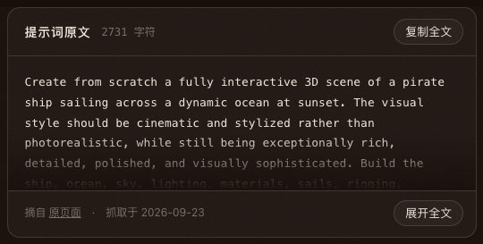
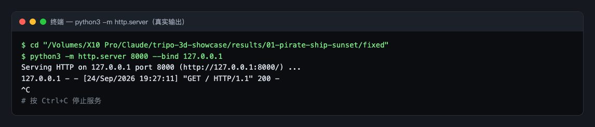
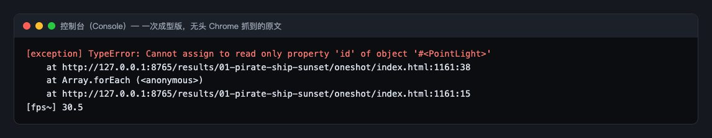
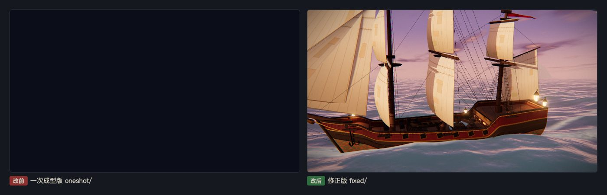
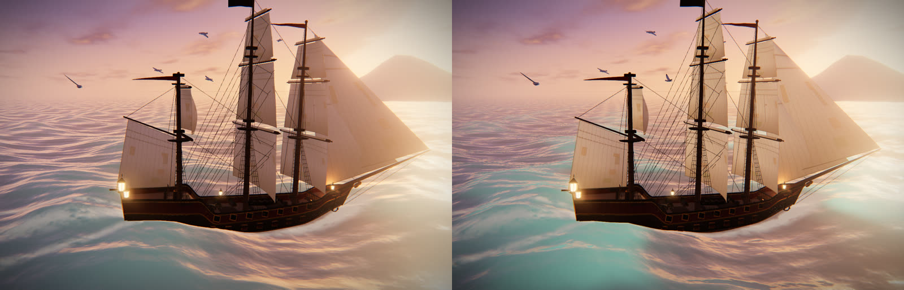
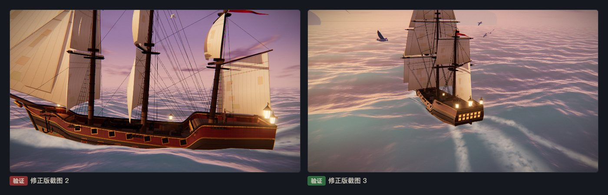

# 第 01 章教程：日落海盗船，从一段提示词到能跑的 3D 网页

> 写给刚学网页开发的同学。下面每一步都是本项目真实做过的操作，截图也都来自本项目。你照着做，结果会因为模型每次生成的代码不同而有出入，但步骤和排错思路是一样的。

## 第 1 步：找到提示词，整段复制

**做什么**：打开 Tripo 的提示词页面 [Cinematic interactive pirate ship at sunset](https://www.tripo3d.ai/3d-prompts/claude-opus-5-5-2102533729746882985)（作者 Vib3Coded），找到正文里那一大段英文提示词，从 `Create from scratch` 一直选到最后的 `brief response.`，复制。也可以直接在本展示页第 01 章点「复制全文」，内容和原页面逐字相同。

**为什么**：这条提示词里有很多硬性要求，比如「场景里不许出现任何文字」「必须是一个能直接双击打开的单文件」「做完要自己在浏览器里测、截图、修」。少复制一句，模型就少遵守一条，所以要整段复制，一个字都不改。

**会看到什么**：一段约 2700 个字符的英文。我们把原文存进了项目里的 `prompts/01-pirate-ship-sunset.md`，同时记下页面地址、作者和抓取日期，方便以后查证。



## 第 2 步：打开终端，把提示词交给 Claude Code

**做什么**：

1. 打开终端。Mac：按 `Command + 空格`，输入 `终端` 或 `Terminal`，回车。Windows：在开始菜单搜索 `PowerShell` 打开。
2. 如果还没装 Claude Code，按 [官方安装说明](https://docs.claude.com/en/docs/claude-code/setup) 装好。
3. 用 `cd` 进入你想放项目的文件夹，然后输入 `claude` 回车，进入交互界面。
4. 把第 1 步复制的提示词粘贴进去（Mac 用 `Command + V`），回车。

**为什么**：`cd` 是「换到这个文件夹」的意思。Claude Code 会把生成的文件写在你当前所在的文件夹里，所以要先进对地方。

**会看到什么**：Claude 开始写代码、建文件，过程中可能会问你要不要允许它写文件或运行命令，按提示同意即可。

我们实际是用无人值守的方式跑的：把 6 条提示词都写进任务书，用 `claude -p "……"` 一次性跑完，下图是 `run.sh` 里的真实命令。第一次学的话用交互式更直观，图的下半部分就是交互式的写法。


## 第 3 步：用本地服务打开「一次成型版」

**做什么**：Claude 写完后，我们把第一次写出来的文件原样存成 `oneshot/index.html`（一次成型版），一个字都不改，留作对照。然后在终端里进入这个文件夹，开一个本地服务：

```
cd results/01-pirate-ship-sunset/oneshot
python3 -m http.server 8000 --bind 127.0.0.1
```

再在浏览器地址栏打开 `http://127.0.0.1:8000/`。

**为什么**：`python3 -m http.server` 的意思是「用 Python 自带的小工具，把当前文件夹变成一个网站」。`8000` 是端口号，可以理解成门牌号；`--bind 127.0.0.1` 表示只让你自己这台电脑访问。很多 3D 网页要加载额外的文件，浏览器出于安全考虑，不允许用 `file://` 直接双击打开的页面随便读文件，所以一般都要用本地服务打开。这一条提示词特别要求「能直接双击打开」，所以最后我们两种方式都测了。用完在终端按 `Ctrl + C` 停掉服务。

**会看到什么**：终端里出现 `Serving HTTP on 127.0.0.1 port 8000`，每打开一次页面就多一行 `"GET / HTTP/1.1" 200`，200 表示文件成功送到了浏览器。浏览器里的画面却是**一片深蓝黑色，什么都不动**。




## 第 4 步：按 F12 打开控制台，读懂报错

**做什么**：在 Chrome 里按 `F12`（Mac 按 `Command + Option + J`），打开开发者工具，点上方的 **Console（控制台）** 标签，然后刷新页面。

**为什么**：页面黑屏时，浏览器几乎总会在控制台里写下原因。红色的行就是报错，后面的 `index.html:1161:38` 表示「出错位置在 index.html 的第 1161 行、第 38 个字符」。

**会看到什么**：一条红色报错：

```
TypeError: Cannot assign to read only property 'id' of object '#<PointLight>'
    at .../oneshot/index.html:1161:38
```

白话翻译：「不能给 PointLight（点光源）对象的 `id` 属性赋值，它是只读的。」three.js 会自动给每个物体编一个 `id` 号，不允许别人改。代码想借 `id` 存一个数字，一存就报错。JavaScript 一报错，后面的代码都不执行了，包括让画面动起来的动画循环，所以整屏停在黑色遮罩上。



## 第 5 步：动手修，一共 7 处

把 `oneshot/` 复制一份成 `fixed/`，只在 `fixed/` 里改，这样两版都留着可以对照。下面是 `diff` 命令比出来的全部改动。

### 改动 1（必须改）：别碰 three.js 的 `id`

```
// 改前：把相位存进只读的 id
lanternLights.forEach((l, i) => l.id = i * 2.1);
... Math.sin(time * 11 + l.id) ...

// 改后：存进 three.js 专门留给用户放东西的 userData
lanternLights.forEach((l, i) => l.userData.ph = i * 2.1);
... Math.sin(time * 11 + l.userData.ph) ...
```

`userData` 是 three.js 给每个物体准备的「私人口袋」，里面放什么都行，不会和内部属性打架。`ph` 是 phase（相位）的缩写，用来让几盏灯笼闪烁的节奏错开。

### 改动 2（必须改）：变量要先声明再使用

修好第 1 处后刷新，控制台又冒出一个着色器编译失败，海面画不出来。原因是海面着色器里，波浪函数用到了 `uTime`（当前时间），但 `uniform float uTime;` 这句声明写在了波浪函数后面。着色器语言和 C 语言一样，要求先声明后使用。

```
// 改前：GLSL_WAVES（里面用到 uTime）排在声明前面
vertexShader: GLSL_WAVES + `
    uniform float uTime;
    ...

// 改后：把声明挪到最前面
vertexShader: 'uniform float uTime;\n' + GLSL_WAVES + `
    ...
```

着色器（shader）是跑在显卡上的小程序，负责算每个点的位置和颜色。

### 改动 3～6（提示词要求的「看得见的问题」）：海天线和吃水线

能跑之后截图检查，发现两个画面问题：

- **海和天之间有一条生硬的直线。** 一是天空在地平线以下的颜色突然变成一半亮度，二是海面网格不够大，远处露了底。

```
// 天空：地平线以下不再突然减半
if (y < 0.0) col = mix(hz * 0.55, ...);   // 改前
if (y < 0.0) col = mix(hz, ...);          // 改后

// 海面边长 2600 → 9000
const seg = isSmall ? 260 : 380, size = 2600;   // 改前
const seg = isSmall ? 260 : 380, size = 9000;   // 改后

// 相机能看到的最远距离 5000 → 20000，否则大海面的远处会被裁掉
new THREE.PerspectiveCamera(42, innerWidth / innerHeight, 0.3, 5000);    // 改前
new THREE.PerspectiveCamera(42, innerWidth / innerHeight, 0.3, 20000);   // 改后
```

- **船浮得太高**，本该在水下的铜皮整段露在水面上。把船整体往下沉 0.8：

```
ship.position.y = motion.heave * 0.9 - 0.15;   // 改前
ship.position.y = motion.heave * 0.9 - 0.95;   // 改后
```

### 改动 7：消掉 favicon 的 404

```
<link rel="icon" href="data:,">
```

浏览器会自动去要网站小图标 `favicon.ico`，本地没有这个文件，控制台就多一条 404。加这一行告诉浏览器「图标是空的，别去要了」。和画面无关，只是让控制台干净，方便看出真正的报错。



## 第 6 步：v3，不换模型，只改着色器

这条提示词要求船、海、灯光全部从空白页面自己造，没有能换成生成模型的地方。所以 v3 一分钱没花：把 `fixed/` 复制成 `v3/`，只改「光怎么照到东西上」的着色器代码（着色器是在显卡上跑、给每个像素算颜色的小程序）。一共四处，都在 `v3/index.html` 里，搜 `v3:` 能找到。

**① 帆布透光。** 帆是薄布，太阳从背面照过来时，正面也会亮，补丁和缝线因为布更厚，会透出深色的影子。three.js 自带的材质不算这个，我们用 `onBeforeCompile`（在材质编译前往里面插一段自己的代码）补上：

```
float through = max(-dot(normal, sunV), 0.0);                        // 太阳在帆的另一面
float ahead = pow(max(dot(normalize(vViewPosition), sunV), 0.0), 4.0); // 镜头、帆、太阳差不多在一条线上
reflectedLight.indirectDiffuse += diffuseColor.rgb * 太阳颜色 * through * (0.5 + ahead * 2.4);
```

乘上 `diffuseColor`（帆布贴图的颜色），透过来的光就带着补丁的深浅。

**② 浪尖泛玉绿。** 迎着低太阳看海浪时，浪尖薄的地方光能穿过去，呈现玉绿色，这叫次表面散射。做法是：看的方向越对着太阳、这个点越靠近浪尖，就往海水颜色里加越多的绿：

```
float back = pow(max(dot(视线水平方向, 太阳水平方向), 0.0), 2.0);
float thin = smoothstep(-0.1, 0.9, 浪高) * (1.0 - 朝上的程度 * 0.55);
water += vec3(0.06, 0.42, 0.30) * back * thin * 近处才有 * 2.2;
```

**③ 海面别像镜子。** 原来贴着海面看时，反射率（菲涅尔系数）会接近 1，整片海变成天空的镜子、发白。真实的粗糙海面达不到这么高，我们把它封顶在 0.62；另外，反射方向朝下的像素（其实会照到下一个浪上）改成取海水颜色，而不是去取亮得发白的地平线。

**④ 光柱。** 太阳入画时，从每个像素朝太阳在屏幕上的位置走 48 步，只收集特别亮的像素（太阳本身）；桅杆和帆挡住的地方收集不到，于是出现一道道光柱。这是后期处理（整张画面算完之后再加工一次），只在镜头朝向太阳时开启，默认运镜里出现得不多。



**为什么**：这四处都不增加模型和贴图，只改算颜色的方法，所以文件大小几乎不变，帧数也基本不掉。这就是「自己能做好的，不花钱」。

为了截同一时刻做对比，v3 还加了一个网址参数：`v3/index.html?t=60` 会从自动运镜第 60 秒开始，镜头第一帧直接到位；`?rays=0` 关掉光柱。

## 第 7 步：验证真的做好了

**做什么**：

1. 用本地服务打开 `fixed/index.html`，F12 看控制台：要做到 **0 条报错、0 条警告**。
2. 再直接双击 `fixed/index.html`（地址栏是 `file://` 开头）打开一次，控制台同样要 0 条报错。这是提示词的硬要求。注意 three.js 是从网上的 CDN 加载的，所以要联网。
3. 看完整一轮自动运镜，检查海天线、吃水线，确认画面里一个字都没有。
4. v3：打开 `v3/index.html?t=60`，和 `fixed/` 同一时刻比；控制台同样要 0 报错。

**为什么**：「页面能打开」不等于「做好了」。要把提示词里每一条硬要求逐条对一遍，再用控制台确认没有隐藏的错误。

**会看到什么**：我们在本机无头 Chrome（没有界面、用脚本驱动的 Chrome）里 1400×900 测试：两种打开方式都是 0 报错，约 30 帧每秒（无头环境没有显卡加速，真机会更流畅）。下图是修正版自动运镜里的两个机位。



v3 在同一台机器上用无头 Chrome 截了第 60 秒：0 报错。这台无头 Chrome 这次退回了软件渲染，约 1 帧每秒，所以帧数不能代表真机。

> 还没修的小问题（如实记录）：远处小岛只是一团带雾的剪影；帆离近了能看出是平面网格，没有布料厚度。v3 的光柱只在镜头朝向太阳时出现，默认运镜里很少碰到；用 `?t=` 跳到船尾机位（约第 27 到 31 秒）时，软件渲染下修正版和 v3 都会出现一块黑框和大片发白，没改过的修正版也一样，所以不是 v3 引入的；修正版正常播放到第 28 秒的留证截图没有这个问题。我们没在真显卡上复查。
