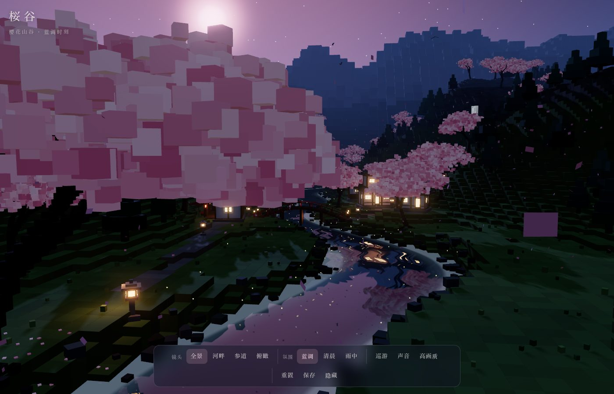
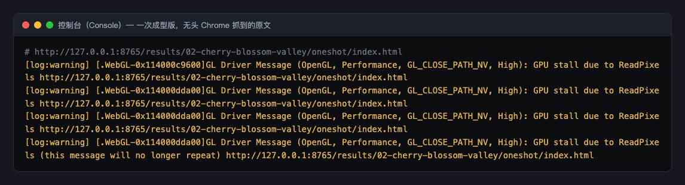
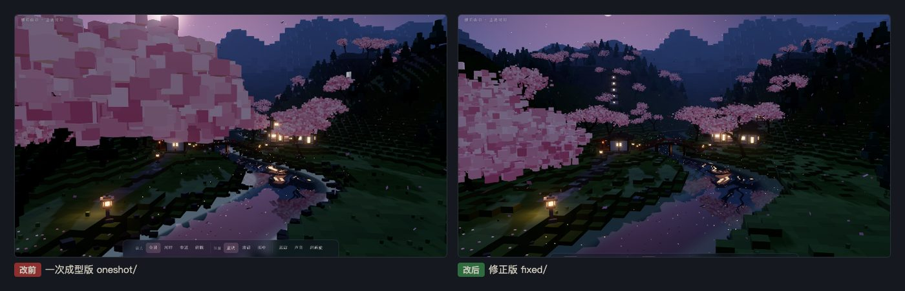
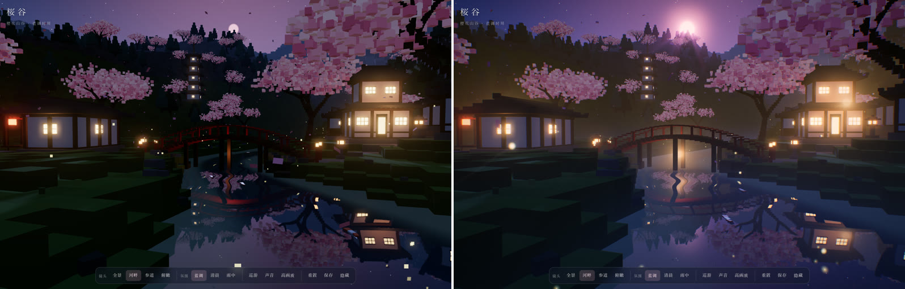
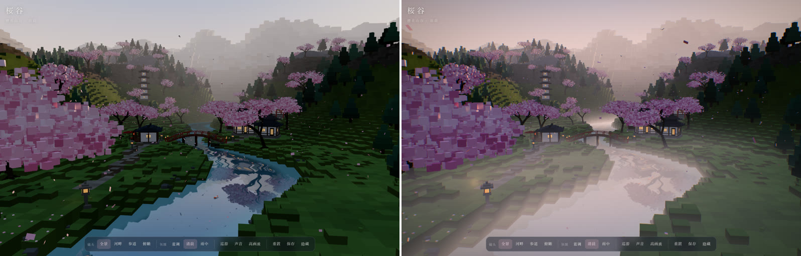
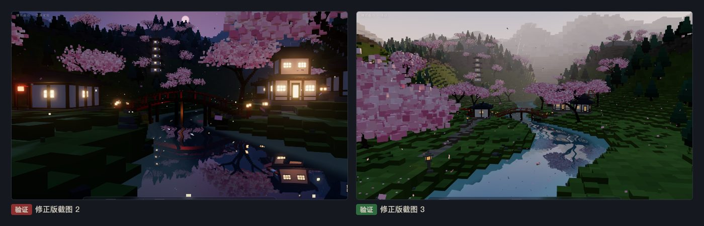

# 第 02 章教程：樱花山谷，能跑不等于好看

> 写给刚学网页开发的同学。这一章的一次成型版**没有报错、能正常运行**，问题全在画面上。它教你的是：控制台干净之后，还要用眼睛逐项验收。

## 第 1 步：找到提示词，复制中文原文

**做什么**：打开 Tripo 的提示词页面 [Interactive 3D Japanese Cherry Blossom Valley Web Experience](https://www.tripo3d.ai/3d-prompts/claude-opus-5-5-2102565403109085669)（作者宝玉）。页面默认显示 Tripo 自动翻译的英文，先点 **Show original**，切到作者写的中文原文再复制。或者在本展示页第 02 章点「复制全文」。

**为什么**：翻译会丢细节。这条提示词很长（300 多行），分了八段，写了地形、樱花树、建筑、水面、氛围切换、界面按钮，第八段还规定了验收方法。用原文最能还原作者的本意。

**会看到什么**：一段很长的中文提示词，开头要求做一个「现代精细体素风」的日式樱花山谷。「体素」就是像《我的世界》那样由小方块组成的画风，这是作者想要的风格，不是缺陷。


## 第 2 步：在终端里交给 Claude Code

**做什么**：打开终端（Mac 按 `Command + 空格` 搜「终端」；Windows 搜 `PowerShell`），`cd` 进项目文件夹，输入 `claude` 回车，粘贴提示词，回车。

**为什么**：和第 01 章一样。我们实际是 6 条提示词写进同一份任务书、在同一个会话里连续跑的，这一条是第二条。

**会看到什么**：Claude 写出一个约 890 行的 `index.html`。它没有用任何图片或模型文件，所有方块、树、房子都是代码现场生成的。


## 第 3 步：用本地服务打开一次成型版

**做什么**：

```
cd results/02-cherry-blossom-valley/oneshot
python3 -m http.server 8000 --bind 127.0.0.1
```

浏览器打开 `http://127.0.0.1:8000/`。

**为什么**：`python3 -m http.server` 用 Python 自带的小工具把当前文件夹变成一个只有你能访问的网站（`127.0.0.1` 就是「本机」），`8000` 是端口号。3D 页面通常要走 `http://` 才能正常加载。用完按 `Ctrl + C` 停掉。

**会看到什么**：页面能跑，底部有一排按钮，可以切镜头、切氛围。但仔细看，毛病很多：

1. 左上半个画面被前景那棵古树的粉色大方块占满。
2. 草地和河里散落很多近黑色的小方块，有的石头浮在水面上。
3. 河岸一圈泛白，像结了冰。
4. 山坡变成一道道规则的台阶条纹，这正是提示词点名要避免的。
5. 月亮光晕太大太亮。
6. 右侧山坡前悬着一块白色长方形，那是没贴住地形的瀑布。
7. 「参道」镜头被屋顶挡住，「俯瞰」镜头前面堆着一片黑色针叶树。
8. 底部控制条在宽屏上也折成了两行。



## 第 4 步：按 F12 看控制台，确认没有真正的报错

**做什么**：按 `F12`（Mac 按 `Command + Option + J`）打开开发者工具，切到 **Console** 标签，刷新页面。

**为什么**：先排除代码层面的错误，才能确定剩下的都是画面问题。

**会看到什么**：没有红色报错，只有几条黄色警告 `GPU stall due to ReadPixels`。白话翻译：「显卡等了一下，因为有代码在从画面里读像素。」这是我们测试时用脚本截图引起的，只是性能提示，不影响页面。另外会有一条 `favicon.ico` 的 404，意思是浏览器想要网站小图标但没找到，也无害。



## 第 5 步：对着截图修，一共 19 处

提示词第八段写的是「根据截图修正构图、曝光、遮挡和渲染问题」。所以这一步不是修代码错误，而是一边截图一边调参数。复制一份成 `fixed/`，只改 `fixed/`。下面挑最有代表性的几处。

### 前景古树缩小、挪到边上，花簇方块变小

```
// 改前
sakura(-6, 42, 1.75, 7, { lean: .55, depth: 5, dense: 1.1 });
const sz = (.18 + r() * .22) * s;

// 改后：整体 1.75 → 1.4，往左挪；每个花簇方块缩小约 40%，但更密
sakura(-7.5, 43, 1.4, 7, { lean: .6, depth: 5, dense: 1.5 });
const sz = (.13 + r() * .15) * Math.min(s, 1.1);
```

`sakura(x, z, 尺度, …)` 是代码里种樱花树的函数。树太大就把尺度调小，花簇太粗就把方块调小、同时调高密度，树冠看起来就细了。

### 黑色小方块：石头少放、调亮、不许下水

```
// 改前：420 块石头，颜色很深，水里也放
for (let k = 0, tries = 0; k < 420 && tries < 20000; tries++) {
  const h = Math.max(WATER_Y - .1, hAt(x, z));
  ... 0x4a4c49 : 0x3d443c ...

// 改后：150 块，更亮，地面低于水面就跳过
for (let k = 0, tries = 0; k < 150 && tries < 20000; tries++) {
  const h = hAt(x, z); if (h < WATER_Y + .2) continue;
  ... 0x6a6d68 : 0x5a6358 ...
```

`0x4a4c49` 是十六进制颜色，数字越大越亮。`continue` 的意思是「这一块不放了，直接试下一块」。草丛也同样从 900 丛减到 500 丛，改小改亮。

### 山坡台阶条纹：加一点随机抖动

```
// 改前：高度直接四舍五入到 0.5 的倍数，同一高度连成一条线
HF[j * GW + i] = h > 0 ? Math.round(h * 2) / 2 : h;

// 改后：取整之前加一点随机数，打散规则的条纹
HF[j * GW + i] = h > 0 ? Math.max(0, Math.round(h * 2 + (hash2(x * 1.7, z * 1.3) - .5) * .9) / 2) : h;
```

体素地形要把连续的高度变成一格一格，这叫「量化」。直接取整，等高的格子会连成一圈圈的线。取整前加一点随机噪声，边界就变得不规则，像自然的山坡。

### 瀑布贴不好，就删掉

提示词把瀑布列为「可以有」，不是必须有。它是一块悬空的白色长方形，贴不住地形，所以整段删掉（17 行），连同动画里更新它的两处代码。

### 控制条折行：换一种居中方法

```
/* 改前：left:50% 再往回挪一半。元素宽度最多只能到半屏，放不下就折行 */
#bar { position: fixed; left: 50%; transform: translateX(-50%); ... }

/* 改后：左右都贴边，再用 margin:auto 居中，宽度按内容来 */
#bar { position: fixed; left: 0; right: 0; margin: 0 auto; width: fit-content; ... }
```

这是网页布局里很常见的坑。`left: 50%` 让元素从屏幕中线开始，右边只剩半屏宽，内容多了就被挤成两行。改成左右都为 0、`margin: 0 auto`，可用宽度是整屏。

### 其他几处

- 水面去掉岸边那一圈发白的亮边，浅水提亮的幅度调低。
- 月亮光晕收小，月盘从约 2° 缩到约 0.8°。
- 「参道」镜头挪到第一座鸟居后面；「俯瞰」镜头抬高后移，机位附近不再种针叶树（`if (Math.hypot(x + 36, z - 12) < 16) continue;`）。
- 离镜头 3.5 以内的花瓣不画，避免一片花瓣贴脸变成巨大色块。
- 蓝调时刻的环境光 1.1 → 1.3，草地不那么黑。
- 加 `<link rel="icon" href="data:,">` 消掉 favicon 的 404。



## 第 6 步：v3，体素不动，只改光和空气

原文要的就是「现代精细体素风」，所以 v3 不换成生成的模型，形状一块都不改，一分钱也没花。做法和第 04 章一样：把 `fixed/` 复制成 `v3/`，只改着色器（在显卡上跑、给每个像素算颜色的小程序）和后期（整张画面渲染完以后再加工一遍）。改动都在 `v3/index.html` 里，搜 `v3：` 能找到。

**① 谷底薄雾，灯笼在雾里发光。** 修正版的雾只按距离混一层颜色。v3 把 three.js 的雾代码整段换掉（`THREE.ShaderChunk.fog_*` 四段），所有带雾的材质都会自动用上新的。新雾有三层：原来的距离雾照旧；再加一层贴着谷底的薄雾，越低越浓；最后让灯笼光在雾里散开。第三层是这样算的：

```
// 对每盏灯：视线上离灯最近的那一点，到灯的距离是 h
float tc = dot(灯 - 镜头, 视线方向);
float h  = sqrt(max(dot(灯 - 镜头, 灯 - 镜头) - tc * tc, .04));
glow += (atan((到物体的距离 - tc) / h) + atan(tc / h)) / h;   // 平方反比光沿视线积分的现成公式
```

**为什么**：灯笼光晕不用贴图，也不用额外几何体，5 盏灯就是 5 次循环，便宜，而且换镜头角度时光晕的形状会跟着变，像真的一样。

**会看到什么**：蓝调时拱桥下、石灯笼旁各起一团暖光；清晨时河面上浮着一层白雾，近处的草地仍然清楚。一开始雾从镜头脚下就开始浓，整张画面发白（下面清晨对比图就是调过以后的样子），后来改成离镜头 6 米以外才慢慢起雾：`smoothstep(6., 70., 距离)`。

**② 月光光束。** 月盘放大、加一圈月晕；再加一道后期：每个像素朝月亮在屏幕上的位置走 48 步，只收集天空里最亮的像素。和第 04 章一样，地面材质把透明度写成 0、水面写 0.5，只有天空是 1，山脊和树冠就会挡光，缝隙里漏出光束。清晨时光源换成太阳，雨天关掉。

**③ 花冠随风起伏。** 樱花是几万个小方块（实例化），在顶点着色器里按每块的位置加两层正弦位移，幅度约 4 厘米：

```
vec3 ip = instanceMatrix[3].xyz;                       // 这一块在世界里的位置
float sw = sin(时间 * 1.1 + ip.x * .35 + ip.z * .22) + .5 * sin(时间 * 2.3 + ip.z * .6 + ip.y);
transformed.xz += vec2(.045, .03) * sw / 这一块的缩放;    // 除以缩放，大块小块晃得一样多
```

**④ 花瓣落水的涟漪。** 花瓣落到水面时，JavaScript 记下位置和时间（最多同时 12 个）；水面着色器对每个涟漪算一圈往外扩的细波，把倒影错开一点，再在波峰上提一点亮。

**⑤ 萤火虫会闪。** 原来是一样亮的小点，现在每只按自己的节奏一明一灭，亮的时间短、暗的时间长，中间亮核外面一圈柔光。

**⑥ 调色。** 轻 S 曲线，暗部偏蓝、亮部偏暖粉，加暗角和很细的胶片颗粒。





为了截同一个画面做对比，v3 加了网址参数：`?v=1` 直接从河畔镜头开始（0 全景、1 河畔、2 参道、3 俯瞰），`?m=morning` 直接从清晨开始，`?rays=0` 关掉光束。

> 如实记录：花冠摆动和涟漪是动的，静态截图里看不出来，要打开页面看；雨中氛围的雾最淡，变化最小。

## 第 7 步：验证

**做什么**：

1. 1400×900 下把 4 个镜头、3 种氛围（蓝调、清晨、雨中）逐个切一遍，截图检查有没有空白、穿帮、遮挡。
2. 把浏览器窗口缩到手机宽度（我们用 390×844），看按钮有没有越界。
3. 每个按钮都点一遍：画质切换、隐藏界面、巡游、保存截图。
4. F12 看控制台，要 0 条报错。再双击用 `file://` 打开一次，也要 0 报错。

**会看到什么**：我们在本机无头 Chrome 里测：画面正常，控制台 0 报错，按钮都能用，保存按钮生成了一张 1.27 MB 的 PNG。声音按钮用脚本点击会被浏览器拦下（浏览器规定声音必须由真人点击触发），真人点击才会出声。



> 如实记录没测到的：真机手机的触屏手势、声音的实际听感、真实显卡上的帧数。还没修的：前景花簇离近了仍然能看出方块；五重塔在蓝调时轮廓偏暗。
