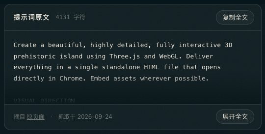
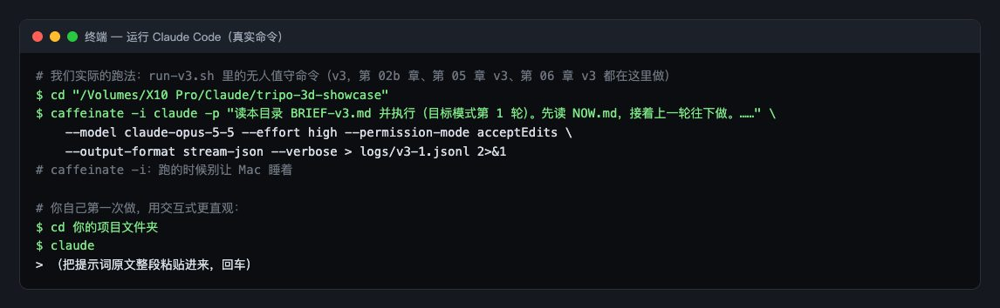
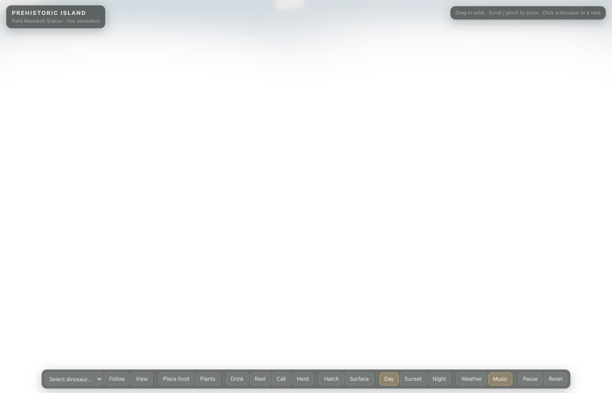
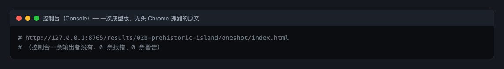
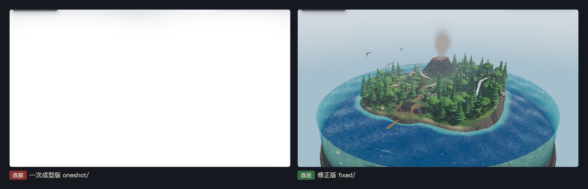
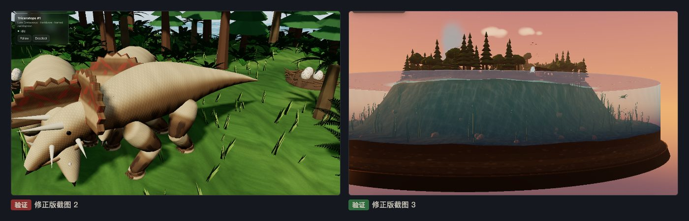

# 第 02b 章教程：史前岛，控制台一片干净，画面却一片白

> 写给刚学网页开发的同学。这一章是 v3 新加的：樱花谷按原文保留了体素风，所以另外从 Tripo 的 Claude Opus 5.5 专区挑了一条要求「有贴图、有质感」的提示词。它的一次成型版最难查：**没有任何报错，画面却是全白的。**

## 第 1 步：找到提示词，整段复制

**做什么**：打开 [Interactive 3D Prehistoric Island](https://www.tripo3d.ai/3d-prompts/claude-opus-5-5-2102450239923720440)（作者 Vib3Coded），这是 Opus 5.5 专区排在最前面的一条。把正文的英文提示词整段复制，或者在本展示页第 02b 章点「复制全文」。

**为什么**：提示词要的东西很多：一座带水下剖面的小岛，会走路、觅食、喝水、休息的恐龙，昼夜和天气切换，音乐，最后还要在浏览器里自测。少一句就少一项。

**会看到什么**：一段英文长提示词。我们把它原样存进 `prompts/02b-prehistoric-island.md`，并记下页面地址和抓取日期。



## 第 2 步：在终端里交给 Claude Code

**做什么**：打开终端（Mac：`Command + 空格` 搜「终端」；Windows：搜 `PowerShell`），`cd` 进项目文件夹，输入 `claude` 回车，粘贴提示词，回车。

**为什么**：这一章是在 v3 那一轮做的，我们用 `run-v3.sh` 无人值守地跑，命令见下图上半部分。你第一次做用下半部分的交互式写法就行。

**会看到什么**：大约 48 分钟后，Claude 写出一个约 1590 行、145 KB 的 `index.html`。岛、水、恐龙骨骼、皮肤花纹全是代码生成的，没有用外部图片或模型。



## 第 3 步：用本地服务打开一次成型版

**做什么**：

```
cd results/02b-prehistoric-island/oneshot
python3 -m http.server 8000 --bind 127.0.0.1
```

浏览器打开 `http://127.0.0.1:8000/`。

**为什么**：`python3 -m http.server` 用 Python 自带的小工具，把当前文件夹变成一个只有本机能访问的网站，`8000` 是端口号。3D 页面一般要用 `http://` 打开才稳妥。用完按 `Ctrl + C` 停掉。

**会看到什么**：界面都在，左上角有标题，底部一排按钮，点了也有反应，帧率约 60。可是中间的 3D 画面是**一整片白**，岛和恐龙都看不见。



## 第 4 步：按 F12 看控制台，发现什么都没有

**做什么**：按 `F12`（Mac 按 `Command + Option + J`），切到 **Console** 标签，刷新。

**为什么**：碰到画面异常，第一步永远是看控制台。

**会看到什么**：**一条输出都没有**，0 条报错、0 条警告。这说明 JavaScript 代码本身没出错，问题出在显卡上跑的着色器（shader）算出来的颜色。着色器算错了不会在控制台报错，只会画错。



我们最后查到的原因在地形着色器的水下焦散函数里（下一步细讲）。你自己碰到这种情况，可以用「排除法」：画面整个发白，最可疑的是会放大亮度的效果。这个页面开了泛光（bloom，让亮的地方向四周发光的后期效果），先把它关掉，看看是哪一块地方在发出异常的亮光，再到那一块的着色器里找。

## 第 5 步：修，一共 20 处

复制一份成 `fixed/`，只改 `fixed/`。

### 改动 1（修主问题）：焦散函数不许算出无穷大

「焦散」是阳光穿过水面、在水底形成的那种晃动的亮纹。原来的写法里有一个 `1.0/length(...)`：

```
// 改前（节选）：除以一个长度，长度接近 0 时结果就接近无穷大
c += 1.0/length(vec2(p.x/(sin(i.x+tt)/0.005), p.y/(cos(i.y+tt)/0.005)));
...
return pow(abs(c), 8.0);

// 改后（节选）：只用 sin、乘法、pow，最后再夹在 0 到 1 之间
c += pow(1.0-abs(sin(q.x)*sin(q.y)), 7.0);
...
return clamp(c/3.0, 0.0, 1.0);
```

除数接近 0 时，`1/很小的数` 会变成一个巨大的数，甚至是 NaN（「不是一个数」，比如 0 除以 0 的结果）。某些像素的亮度就变成了天文数字，泛光再把它扩散开，整屏就白了。改后的公式每一项都在 0 到 1 之间，`clamp(值, 0.0, 1.0)` 的意思是「小于 0 就当 0，大于 1 就当 1」，再怎么算也不会失控。

### 改动 2～9：恐龙互相穿模、挤在一起卡住

画面出来以后，按提示词要求逐项测行为，又发现两个问题：两只腕龙的脖子交叉穿过对方，变成一个 X；几只三角龙在同一处同时卡住不动。

原来每种恐龙只用身体上的两个圆判断碰撞，脖子和尾巴不算。改法是给脖子和尾巴也加上圆，标成「软」的（`soft:1`）：

```
// 改前：腕龙只有身体两个圆
circles:[{z:-2.8,r:1.9},{z:1.9,r:2.1}]

// 改后：再加脖子、头、尾巴三个「软」圆
circles:[{z:-2.8,r:1.9},{z:1.9,r:2.1},{z:-5.3,r:1.1,soft:1},{z:-7.3,r:0.6,soft:1},{z:5.2,r:1.2,soft:1}]
```

「软」圆的规矩是：同一群的恐龙之间不算，两个都是软圆也不算。不然一群似鸡龙挤在一起谁都走不动。

然后又加了几处配合：

- 新写一个 `separate()` 函数，每一帧把已经重叠的两只恐龙往相反方向轻轻推开。
- 原地转身也检查碰撞；转不动超过 1.5 秒就短暂放行 1 秒，避免永远卡死。
- 前方被挡住时，先试着向左右斜着走绕开，再算卡住。
- 两只都在走动时，互相不当障碍（交给 `separate()` 处理）。这一条修掉了「几只三角龙同时卡住」。
- 判断能不能踩上某块地时，只看身体的硬圆，门槛从 0.55 放宽到 0.4。

### 改动 10：喝水排队

原来按水边的「位置编号」判断有没有被占，两只恐龙可能选到编号不同、实际却挨在一起的位置。改成按真实距离判断：

```
// 改前：别人占了第 k 号位置，我就不去 k 号
dinos.some(d => d !== this && d.drinkSlot === k && ...)

// 改后：别人要去的位置离这里太近，我就换一个
dinos.some(d => d !== this && d.drinkPos && ... && Math.hypot(d.drinkPos.x - x, d.drinkPos.z - z) < (两只的身宽之和) * 1.3)
```

`Math.hypot(dx, dz)` 就是求两点之间的直线距离。另外，去喝水、去吃东西允许重试 7 次（原来 3 次），群体迁移时不再把正在去吃喝的成员拉走。

最后给 `window.__island` 多暴露了几个对象，只是给我们的自动测试脚本用，不影响页面。



## 第 6 步：本章没有 v3

它本身就是 v3 这一轮新增的一章，只有一次成型版和修正版。

## 第 7 步：验证

**做什么**：

1. F12 看控制台：0 条报错。
2. 把底部按钮逐个点一遍：放植物，看三角龙来不来吃；放肉，看霸王龙来不来吃；喝水、休息、鸣叫、迁移、跟随、暂停、重置、日落视角。
3. 检查穿模：在第 0、15、30、70、90 秒各查一次，任意两只恐龙的身体圆有没有重叠。
4. 同样的「全部去喝水」测试，一次成型版和修正版各跑一遍对比。

**为什么**：这条提示词的重点是「活的生态」，光看画面不够，要按功能一项项测。

**会看到什么**：我们用无头 Chrome 加脚本测：控制台 0 报错；3 只三角龙来吃植物，霸王龙来吃肉；暂停 2 秒，恐龙位移 0.000；5 个时间点的身体重叠都是 0；「全部去喝水」一次成型版 80 秒内只有 1/8 喝到，修正版多数能走到水边。



> 如实记录没测到的：真机显卡帧数、手机触屏、音乐和音效。还没修的：恐龙近看关节有接缝；树是锥体和球体叠的，和恐龙的精细度不一致；水边位置少，第 3 只以后喝水要等很久。
