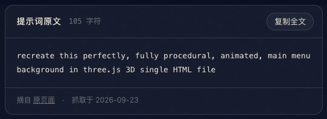
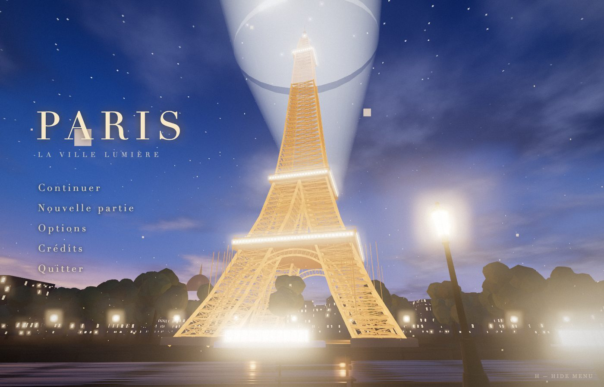
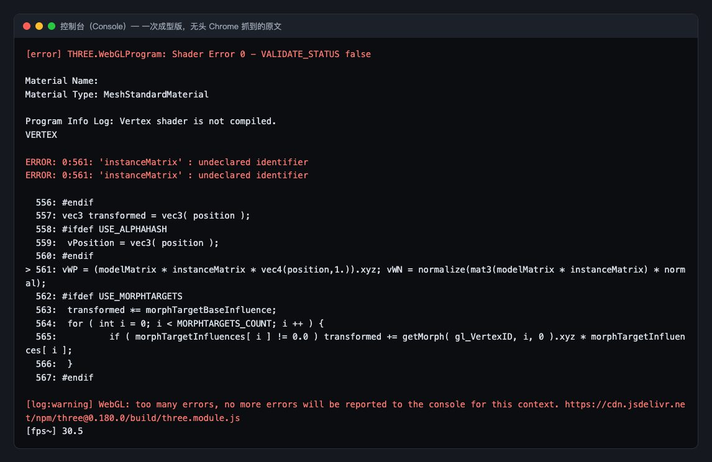
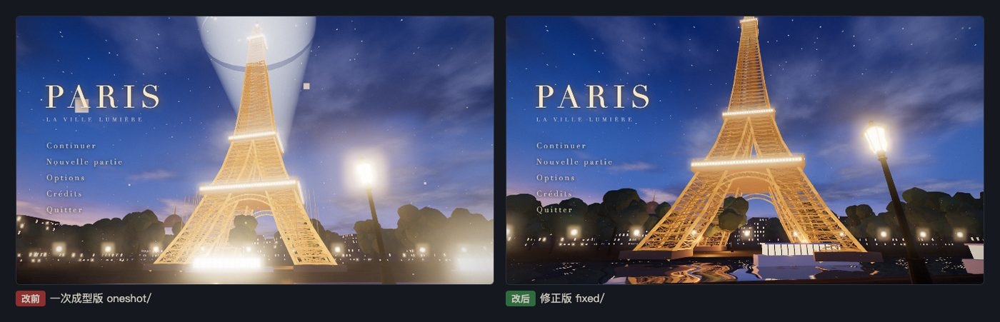
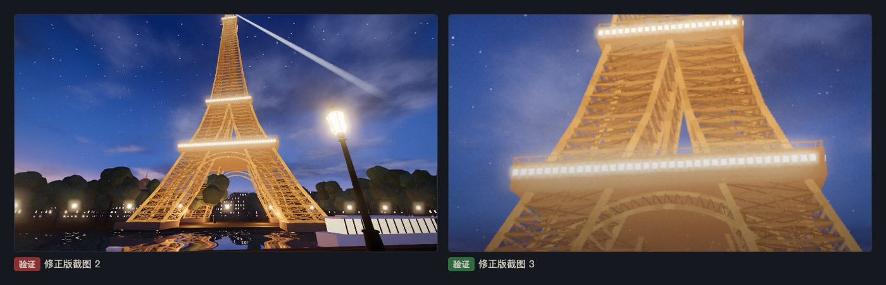

# 第 03 章教程：照着一张图，用一句话做出游戏主菜单背景

> 写给刚学网页开发的同学。这一章的提示词只有一句话，但要配一张参考图。一次成型版能打开，却有两个运行错误：一个会在控制台报红，另一个不报错，只会让画面每隔一阵子黑掉一大块。

## 第 1 步：找到提示词，准备参考图

**做什么**：打开 [Procedural Three.js 3D main menu background from an image](https://www.tripo3d.ai/3d-prompts/claude-opus-5-5-2102544196808667471)（作者 Majid Manzarpour），复制那一句英文：

```
recreate this perfectly, fully procedural, animated, main menu background in three.js 3D single HTML file
```

这句话里的 `this` 指的是一张图。原作者用的图没有公开，所以我们用了一张自己的图 `eiffel_tower_3d_game.png`（1024×1536，蓝调时刻的埃菲尔铁塔，左边塞纳河和游船，右边路灯、湿石板路、长椅）。

**为什么**：几个关键词决定了做法：`fully procedural`（全程序化）是说所有东西都用代码生成，不许直接贴这张图；`animated` 要会动；`single HTML file` 要一个文件搞定。

**会看到什么**：本展示页第 03 章的提示词卡片，点「复制全文」得到的就是这一句。



## 第 2 步：在终端里交给 Claude Code，连图一起

**做什么**：打开终端（Mac：`Command + 空格` 搜「终端」；Windows：搜 `PowerShell`），`cd` 进项目文件夹，输入 `claude` 回车。粘贴提示词，同时告诉它参考图在哪：把图片放进项目文件夹，在提示词后面写上文件路径就行。

**为什么**：Claude Code 能读本机的图片文件，看得到图才能照着做。我们是无人值守跑的，参考图的路径写在任务书里。

**会看到什么**：约 6 分钟后得到一个约 580 行的 `index.html`：铁塔用约一万根杆件拼出来，还有整点闪灯、旋转探照灯、游船、河面倒影，左侧是法式菜单。


## 第 3 步：用本地服务打开一次成型版

**做什么**：

```
cd results/03-main-menu-from-image/oneshot
python3 -m http.server 8000 --bind 127.0.0.1
```

浏览器打开 `http://127.0.0.1:8000/`。

**为什么**：`python3 -m http.server` 用 Python 自带的小工具把当前文件夹变成一个本机网站，`8000` 是端口号。用完按 `Ctrl + C` 停掉。

**会看到什么**：能打开，铁塔也在，但问题一眼可见：

1. 塔顶上方一个巨大的发光圆盘。那是探照灯光束，宽口和窄口做反了，宽口对着镜头。
2. 铁塔和路灯太亮，杆件糊成一片。
3. 空中飘着几个大方块，那是「光尘」粒子做得太大太近。
4. 多看一会儿，会发现**画面每隔一段时间就有一大块变黑**，光束转到某些角度时尤其明显。



## 第 4 步：按 F12 看控制台

**做什么**：按 `F12`（Mac 按 `Command + Option + J`），切到 **Console** 标签，刷新。

**会看到什么**：一大段红色报错，关键是这一行：

```
THREE.WebGLProgram: Shader Error 0 - VALIDATE_STATUS false
ERROR: 0:561: 'instanceMatrix' : undeclared identifier
```

白话翻译：「着色器编译失败，第 561 行用了一个没声明的变量 `instanceMatrix`。」

背景知识：着色器（shader）是跑在显卡上的小程序。`instanceMatrix` 是 three.js 在「实例化网格」（InstancedMesh，一次画很多个相同物体，比如一万根杆件）里才会自动提供的变量。代码把同一个材质既给了远景街区（实例化的），又给了金顶穹顶（普通的一个物体）。穹顶那份着色器里没有这个变量，编译不过，所以穹顶的底座和鼓座不显示。

**而第 4 个问题（周期性黑屏）在控制台里什么都看不到。** 它是着色器算出了「非数值」，这种错误不会报红，只能靠看画面、读代码找。



## 第 5 步：修，一共 16 处

复制一份成 `fixed/`，只改 `fixed/`。前两处修运行错误，其余按提示词里的 `recreate this perfectly` 往参考图靠。

### 改动 1：穹顶单独用一个普通材质

```
// 改前：穹顶借用了街区的材质 cityMat（里面改写过 instanceMatrix）
const drum = new THREE.Mesh(new THREE.CylinderGeometry(12, 12, 16, 24), cityMat);
const base = new THREE.Mesh(new THREE.BoxGeometry(60, 18, 40), cityMat);

// 改后：给穹顶新建一个不带改写的普通材质
const domeMat = new THREE.MeshStandardMaterial({ color: 0x1b1c26, roughness: .9 });
const drum = new THREE.Mesh(new THREE.CylinderGeometry(12, 12, 16, 24), domeMat);
const base = new THREE.Mesh(new THREE.BoxGeometry(60, 18, 40), domeMat);
```

### 改动 2：光束透明度加上 `clamp`，不再算出非数值

```
// 改前
float a = pow(1. - vL, 2.2) * edge * .38;

// 改后
float a = pow(clamp(1. - vL, 0., 1.), 1.8) * edge * .28;
```

`pow(x, 2.2)` 是「x 的 2.2 次方」。显卡在两个顶点之间插值时，`1. - vL` 可能变成一个很小的负数，比如 -0.0001。负数的小数次方在数学上没有定义，显卡会给出 NaN（「不是一个数」）。泛光后期把这个坏像素扩散开，就变成一整块黑。`clamp(值, 0., 1.)` 把它限制在 0 到 1 之间，就不会出现负数了。

### 改动 3：光束倒过来，窄口在塔顶

```
// 改前：顶部半径 0.25、底部半径 26，宽口朝外对着镜头
new THREE.CylinderGeometry(.25, 26, 420, 32, 1, true); ... g.rotateZ(-Math.PI / 2 + .06);

// 改后：顶部 9、底部 0.25，窄口在塔顶；再往上抬约 12°
new THREE.CylinderGeometry(9, .25, 420, 32, 1, true); ... g.rotateZ(-Math.PI / 2 + .22);
```

`CylinderGeometry(顶部半径, 底部半径, 高度, …)`。两个半径对调，喇叭口就反过来了。

### 改动 4～9：压暗过曝

```
// 铁塔自发光 1.0 → 0.6
emissive: 0xffa447, emissiveIntensity: 1.0    // 改前
emissive: 0xffa447, emissiveIntensity: .6     // 改后

// 泛光：强度 .85 → .6，只有亮度超过 .95 的地方才发光（原来 .82）
new UnrealBloomPass(..., .85, .55, .82);   // 改前
new UnrealBloomPass(..., .6, .45, .95);    // 改后
```

另外，斜杆和细杆的颜色再压暗一档（`[1, .78, .62, .5]` → `[1, .7, .45, .3]`），这样杆件能分出层次；路灯灯罩、游船舱窗的颜色值也调低。

### 改动 10～16：构图和小问题

- 删掉拱上那一圈向上戳出塔外的短支杆（2 行）。
- 光尘粒子从 0.09 缩到 0.035、更淡，并且离镜头远一点。
- 镜头往前挪到河岸步道上，视角 68° → 76°，看点放低，把河面倒影收进画面；前景路灯挪到画面右侧、长椅挪到步道上，对应参考图的位置。
- 手机竖屏时，菜单下面加一层从下往上的渐变底色，文字不再被最亮的塔身压住：

```
#menu { top: auto; bottom: 0; padding: 12vh 0 7vh; ...
  background: linear-gradient(to top, rgba(5,10,28,.85), rgba(5,10,28,.55) 70%, transparent); }
```



## 第 6 步：本章没有 v3

提示词要求「全程序化」（fully procedural），换成生成的模型就违背了原文，v3 任务书也没有安排这一条。

## 第 7 步：验证

**做什么**：

1. 用 1400×900、960×540、390×844（手机竖屏）三种窗口大小看。
2. 在 960×540 下连续截 6 张图，时间跨过光束转一整圈（一圈 18 秒），确认一张黑屏都没有。
3. 按 `H` 键，确认菜单能隐藏。
4. F12 看控制台，要 0 条报错；再双击用 `file://` 打开一次，也要 0 报错。

**为什么**：周期性黑屏只在某些时刻出现，截一张图可能正好错过，所以要按时间连续截图。

**会看到什么**：我们用无头 Chrome 测，6 张连续截图都没有黑屏，控制台 0 报错，`H` 键有效。



> 如实记录和参考图的差距：参考图是竖幅仰拍，前景湿石板路占下方三成，这里是横幅菜单背景，石板路基本看不到；杆件是方棍，近看像木结构；天空缺少参考图左下的橙粉色晚霞。
