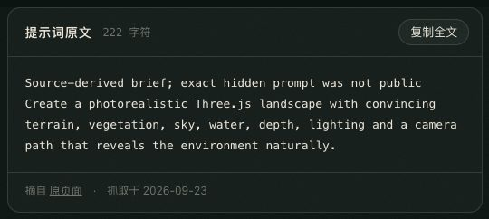
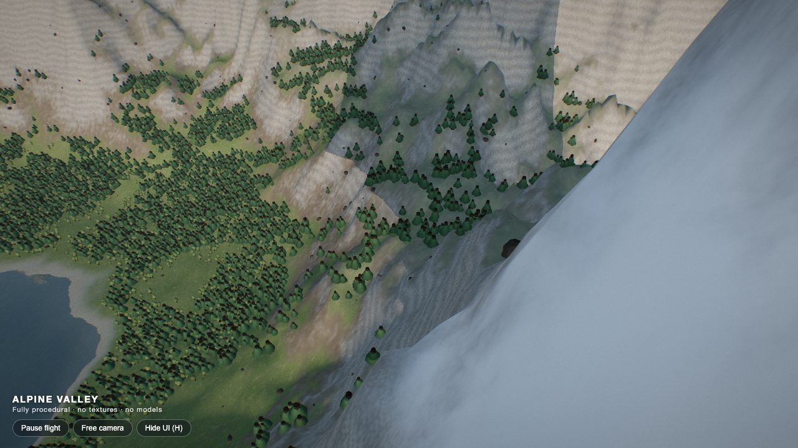
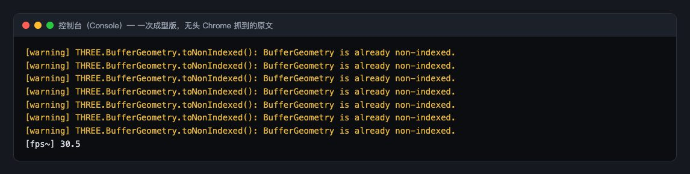
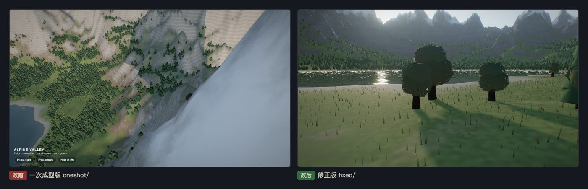
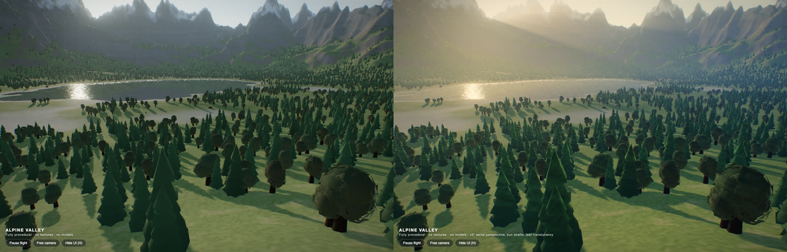
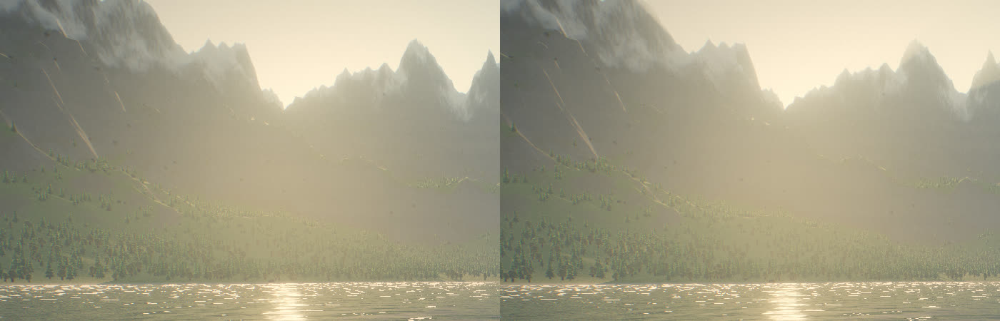
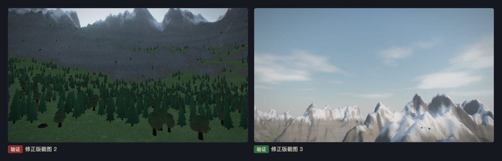

# 第 04 章教程：写实风景，镜头别钻进山里

> 写给刚学网页开发的同学。这一章的一次成型版没有报错，只有 7 条黄色警告。真正的问题要看画面才能发现：镜头飞着飞着钻进了山坡。

## 第 1 步：找到提示词，复制

**做什么**：打开 [Photorealistic Three.js landscape](https://www.tripo3d.ai/3d-prompts/photorealistic-three-js-landscape-2094871858206191667)（作者 Alix Ollivier），复制正文。或者在本展示页第 04 章点「复制全文」。

注意页面自己写着 `Source-derived brief; exact hidden prompt was not public`：这不是作者的原话，而是 Tripo 根据来源整理的一句概要，作者的原始提示词没有公开。我们照这一句做，并在留档里写明了这一点。

```
Create a photorealistic Three.js landscape with convincing terrain, vegetation, sky, water, depth, lighting and a camera path that reveals the environment naturally.
```

**为什么**：要求一共 7 项：地形、植被、天空、水、纵深、光照，以及一条「自然地展示环境」的镜头路线。后面验证时要逐项对照。

**会看到什么**：一句英文。我们存进了 `prompts/04-photorealistic-landscape.md`。另外如实记一笔：第一次抓这个页面返回 404，约 10 分钟后重抓正常，内容没变。



## 第 2 步：在终端里交给 Claude Code

**做什么**：打开终端（Mac：`Command + 空格` 搜「终端」；Windows：搜 `PowerShell`），`cd` 进项目文件夹，输入 `claude` 回车，粘贴，回车。

**会看到什么**：约 2 分钟后得到一个约 420 行的 `index.html`：噪声算出来的湖谷和雪山、四种植被、大气散射天空、带倒影的湖面，还有一条 13 个航点的自动飞行路线。


## 第 3 步：用本地服务打开一次成型版

**做什么**：

```
cd results/04-photorealistic-landscape/oneshot
python3 -m http.server 8000 --bind 127.0.0.1
```

浏览器打开 `http://127.0.0.1:8000/`。

**为什么**：`python3 -m http.server` 用 Python 自带的小工具把当前文件夹变成一个本机网站，`8000` 是端口号。用完按 `Ctrl + C` 停掉。

**会看到什么**：镜头自动飞，但问题不少：

1. **镜头钻进地形**：飞过山坡时，整屏变成一块地面贴图（下图右半边那一大片灰白就是贴着镜头的山坡）。
2. 树干从树冠顶上戳出来，远看像一片火柴棍。
3. 山体上一条条规则的横纹，像等高线图；山峰又尖又高，像钉子。
4. 树叶偏黄偏亮，不像写实的针叶林。



## 第 4 步：按 F12 看控制台

**做什么**：按 `F12`（Mac 按 `Command + Option + J`），切到 **Console** 标签，刷新。

**会看到什么**：没有红色报错，只有 7 条一样的黄色警告：

```
THREE.BufferGeometry.toNonIndexed(): BufferGeometry is already non-indexed.
```

白话翻译：「你要把这个几何体转成非索引格式，可它本来就是非索引的。」

背景知识：一个 3D 物体由很多三角形组成。「索引」是一种省空间的存法，共用的顶点只存一次，三角形用编号去引用它。代码在合并几何体之前，对每个零件都调了一次「转成非索引」，其中有 7 个零件本来就是非索引的，three.js 就提醒一句。它不影响画面，但会让控制台变脏，以后真出错时不容易看到。

**所以这一章的主要问题在控制台里看不到**，要靠看画面、按时间连续截图才能发现。



## 第 5 步：修，一共 12 处

复制一份成 `fixed/`，只改 `fixed/`。

### 改动 1：镜头高度按「周围一圈的最高点」算

原来的代码只看镜头正下方那一个点的地面高度。可镜头在两个航点之间飞，正下方是低谷，前面一点就是陡坡，照样撞上去。

```
// 新增：在半径 r 的一圈上取 8 个点，加上正下方，取最高的那个
function groundMax(x, z, r) {
  let m = Math.max(height(x, z), 0);
  for (let i = 0; i < 8; i++) {
    const a = i / 8 * Math.PI * 2;
    m = Math.max(m, height(x + Math.cos(a) * r, z + Math.sin(a) * r));
  }
  return m;
}

// 每一帧：改前离地至少 3 米，只看正下方
const ground = Math.max(height(tmp.x, tmp.z), 0);
tmp.y = Math.max(tmp.y, ground + 3);

// 改后：离「周围 30 米内最高的地面」至少 8 米
tmp.y = Math.max(tmp.y, groundMax(tmp.x, tmp.z, 30) + 8);
```

`Math.cos(a)`、`Math.sin(a)` 用来在圆周上取点。13 个航点本身也改成用 `groundMax(x, z, 90)` 定高度；低空航点离地高度调高一点，高空航点调低一点，让飞行更贴近风景。

### 改动 2：树干缩短，藏进树冠

```
// 改前：树干高 1，树冠从 0.22 开始，树干自然从顶上戳出来
new THREE.CylinderGeometry(.12, .2, 1, 6); trunk.translate(0, .5, 0);

// 改后：树干高 0.3，细很多
new THREE.CylinderGeometry(.018, .03, .3, 6); trunk.translate(0, .15, 0);
```

树冠的锥体也改成封底（`ConeGeometry` 最后一个参数 `true` → `false`，`true` 表示开口不封底），半径收窄。

### 改动 3：山体去掉横纹，峰不那么尖

```
// 改前：岩石层理用 sin(高度)，同一高度颜色一样，连成一圈圈横纹
float strata = sin(h * .35 + n1 * 9.) * .5 + .5;

// 改后：换成噪声，纹理不再规则
float strata = fbm2(vec2(p.x * .004, h * .03));
```

`sin` 是周期函数，高度每增加一段就重复一次，所以出现等距条纹。`fbm2` 是「分形噪声」，一种看起来自然、不重复的随机起伏。

同时：山脊噪声降频（`/1100` → `/1400`）并加一个 1.35 次方，峰高 1150 → 900，山就不再像钉子；岩石颜色压暗；雪线抬高（`260~420` → `300~480`）。

### 改动 4：树叶颜色

```
// HSL：色相、饱和度、亮度。饱和度 .45 → .32，亮度 .14~.2 → .08~.12
new THREE.Color().setHSL(R(.2, .27), .45, R(.14, .2));   // 改前
new THREE.Color().setHSL(R(.23, .3), .32, R(.08, .12));  // 改后
```

### 改动 5：顺手消掉那 7 条警告

```
mergeGeometries(parts.map(g => g.toNonIndexed()));                // 改前
mergeGeometries(parts.map(g => g.index ? g.toNonIndexed() : g));  // 改后
```

`g.index ? A : B` 的意思是「如果 g 有索引就做 A，否则做 B」。本来就是非索引的零件原样使用，不再转换。



## 第 6 步：v3，不换模型，只改着色器

这条提示词要的是「全程序化」，没有可以换成生成模型的地方。所以 v3 一分钱没花：把 `fixed/` 复制成 `v3/`，只改「光怎么照到东西上」的着色器代码（着色器是在显卡上跑、给每个像素算颜色的小程序）。改动都在 `v3/index.html` 里，搜 `v3:` 能找到。

**① 空气透视。** 修正版用的是 three.js 自带的雾：离镜头越远，颜色越往一种灰色靠。真实的山谷不是这样：谷底空气厚、山顶空气薄；远山偏蓝（蓝光更容易被空气散开）；朝着低太阳看时，整片雾会被照成暖白色。我们把 three.js 的雾代码整段换掉（`THREE.ShaderChunk.fog_fragment` 等四段），所有材质都会自动用上新的：

```
float optical = 浓度 * exp(-镜头高度 / 高度尺度) * 距离 * 沿视线积分;   // 越往高处空气越薄
vec3 ext = exp(-optical * vec3(.62, .82, 1.12));                          // 蓝光衰减得最多
vec3 haze = mix(蓝灰, 暖白 * 1.6, pow(视线和太阳的夹角, 5.) * .75);      // 朝太阳看时雾变暖
col = col * ext + haze * (1. - ext);
```

**② 山口光柱。** 太阳入画时，每个像素朝太阳在屏幕上的位置走 48 步，只收集「天空里特别亮的像素」。山脊和树冠会挡住，挡不住的缝隙里就出现一道道光。关键一步是分清「天空」和「地面」：我们让所有地面材质在输出时把透明度写成 0，只有天空保持 1，光柱只从透明度为 1 的地方收集。不这样做的话，被雾照亮的山坡自己也会发光，整片画面一起发白。

**③ 树冠随风摆、逆光透叶。** 树是成千上万棵同一模型的复制品（实例化），每棵按自己的位置错开一点相位，越往树梢摆得越多；叶子按世界坐标上的噪声分出明暗成团；背对太阳看时，树冠边缘会亮起来，像光从叶子间透过来。

**④ 调色。** 最后一道后期：轻微的 S 形曲线（亮的更亮、暗的更暗）、高光偏暖、阴影偏冷、饱和度略提。





**为什么**：这四处都不增加模型和贴图，只改算颜色的方法，文件大小几乎不变。这就是「自己能做好的，不花钱」。

为了截同一时刻做对比，v3 还加了网址参数：`v3/index.html?t=12` 从飞行第 12 秒开始；`?rays=0` 关掉光柱。

> 如实记录：光柱在大部分镜头里比较淡，只有太阳在两座山之间时才明显；树仍然是锥体叠层，近看还是低多边形，这一步没有改形状。

## 第 7 步：验证

**做什么**：

1. 用 1280×720 和手机竖屏 390×844 看。
2. 录一段飞行（我们录了 11 秒），逐帧看镜头有没有再穿进地里。
3. F12 看控制台：这次要求 **0 条报错、0 条警告**。
4. 双击用 `file://` 打开一次，也要 0 报错。

**会看到什么**：我们用无头 Chrome 测，控制台 0 报错 0 警告，录屏里镜头没有再穿地，约 20–30 帧每秒。



> 如实记录没测到的：三个按钮和自由镜头模式没测；整条飞行路线一圈约 2 分钟，只抽看了几个位置。离「照片级写实」还有差距：树是锥体叠层，近看是低多边形；山壁大面积灰色岩石缺少细节，像一堵平墙；雪线过于整齐。
