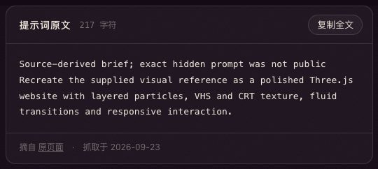
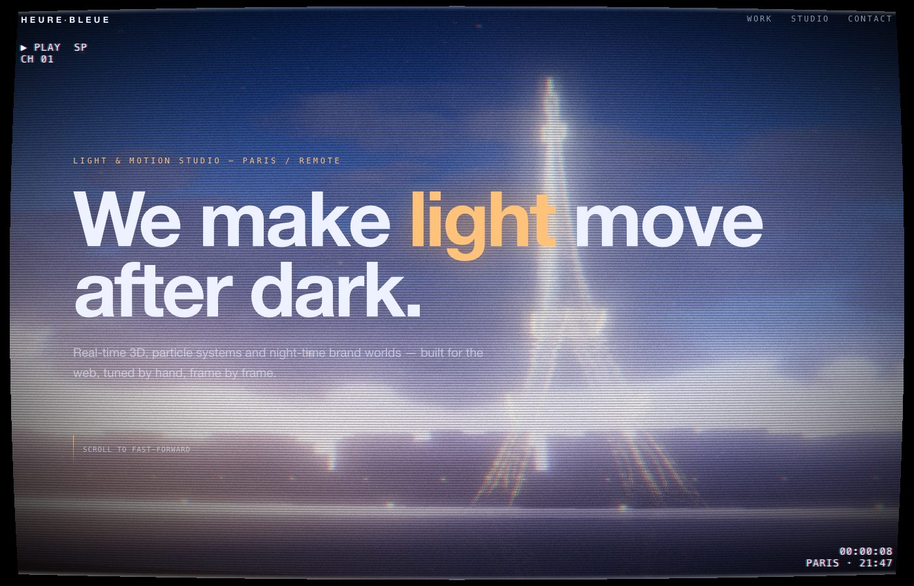
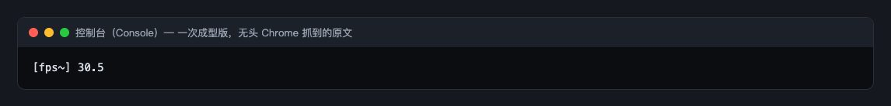
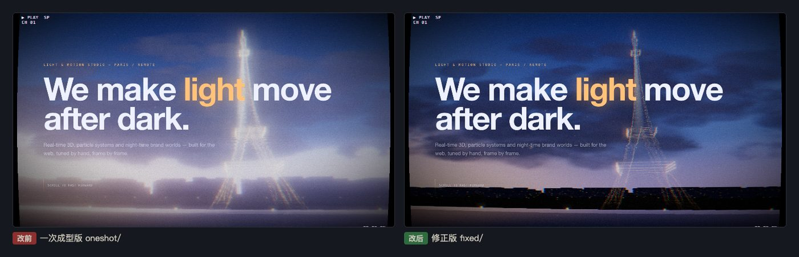
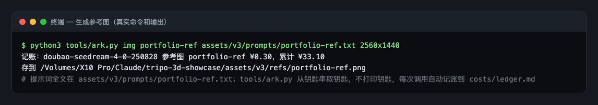
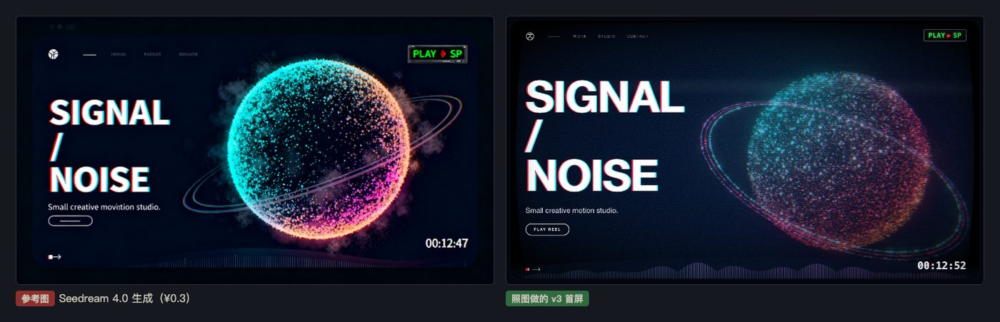
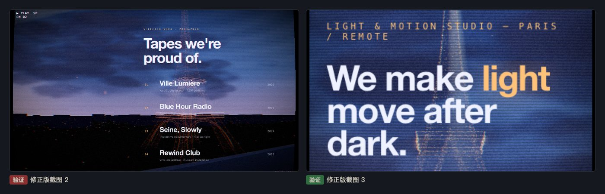
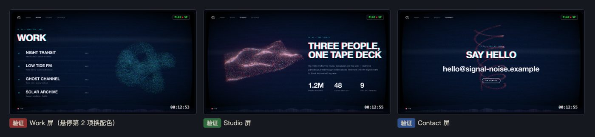

# 第 05 章教程：参考图驱动的作品集网站，以及 v3 怎么先「生」一张参考图

> 写给刚学网页开发的同学。这条提示词要求「照着给定的参考图」做一个网站，可页面并没有给图。我们做了两版：先借用一张埃菲尔铁塔的图做了一次成型版和修正版；v3 再用生图模型按提示词的风格专门生成一张参考图，照图重做。

## 第 1 步：找到提示词，复制

**做什么**：打开 [Reference-driven Three.js portfolio](https://www.tripo3d.ai/3d-prompts/reference-driven-three-js-portfolio-2095104073590808644)（作者 Meng To），复制正文，或在本展示页第 05 章点「复制全文」：

```
Recreate the supplied visual reference as a polished Three.js website with layered particles, VHS and CRT texture, fluid transitions and responsive interaction.
```

页面写明这是「整理 brief」，不是作者的原话。页面上还有原作者的在线演示和源码链接，我们**没有打开、没有参考**，这样我们的成品才是独立做出来的。

**为什么**：关键词要逐个记下来，后面验收用：`layered particles`（多层粒子）、`VHS and CRT texture`（录像带和老式显像管电视的质感）、`fluid transitions`（流畅的过渡）、`responsive interaction`（跟着鼠标或手指有反应）。

**会看到什么**：一句英文。`the supplied visual reference`（给定的参考图）页面没有提供，第一版我们借用了第 03 章那张埃菲尔铁塔图。



## 第 2 步：在终端里交给 Claude Code

**做什么**：打开终端（Mac：`Command + 空格` 搜「终端」；Windows：搜 `PowerShell`），`cd` 进项目文件夹，输入 `claude` 回车，粘贴提示词，并写上参考图的文件路径，回车。

**会看到什么**：约 3 分钟后得到一个约 540 行的 `index.html`：一个虚构的灯光工作室「Heure Bleue」的四屏网站，铁塔由约六万个发光粒子组成，整屏有扫描线、红蓝错位、画面弯曲的 VHS/CRT 效果。


## 第 3 步：用本地服务打开一次成型版

**做什么**：

```
cd results/05-reference-driven-portfolio/oneshot
python3 -m http.server 8000 --bind 127.0.0.1
```

浏览器打开 `http://127.0.0.1:8000/`，往下滚动四屏。

**为什么**：`python3 -m http.server` 用 Python 自带的小工具把当前文件夹变成一个本机网站，`8000` 是端口号。用完按 `Ctrl + C` 停掉。

**会看到什么**：四屏都能滚，没有报错，但画面问题很明显：

1. 整体过曝，铁塔糊成一根白色光柱，看不出金色和钢架结构。
2. 云层被放大成一条白雾带，天空发灰。
3. 首屏的说明文字（大标题下那两行小字）压在亮背景上，几乎看不清。
4. 远景能看到地面和水面平面的边缘，斜着一道亮边。



## 第 4 步：按 F12 看控制台

**做什么**：按 `F12`（Mac 按 `Command + Option + J`），切到 **Console** 标签，刷新。

**会看到什么**：0 条报错、0 条警告。下图里唯一的一行 `[fps~] 30.5` 是我们测试脚本自己记的帧率，不是页面输出的。

**这说明**：所有问题都是「参数没调好」，不是「代码写错」。要靠眼睛看、调参数来修。



## 第 5 步：修，一共 11 处

复制一份成 `fixed/`，只改 `fixed/`。

### 改动 1：泛光的「门槛」调高（修过曝、修白雾）

```
// UnrealBloomPass(尺寸, 强度, 半径, 阈值)
new UnrealBloomPass(new THREE.Vector2(innerWidth, innerHeight), .85, .55, .18);   // 改前
new UnrealBloomPass(new THREE.Vector2(innerWidth, innerHeight), .7, .5, .62);     // 改后
```

泛光（bloom）让亮的地方向周围发光。「阈值」是门槛：只有亮度超过它的像素才会发光。原来门槛只有 0.18，几乎什么都在发光，六万个粒子叠在一起就成了白光柱。调到 0.62 以后，只有真正亮的部分发光。

### 改动 2：铁塔粒子调暗、颜色调深，倒影更淡

```
const gold = new THREE.Color(1, .6, .24), white = new THREE.Color(1, .88, .66);   // 改前
const gold = new THREE.Color(1, .5, .16), white = new THREE.Color(1, .8, .5);     // 改后

const tower = buildPoints(TOWER, pointsMaterial());          // 改前：默认不透明度
const tower = buildPoints(TOWER, pointsMaterial('', .55));   // 改后：不透明度 0.55
```

`THREE.Color(红, 绿, 蓝)` 每个值在 0 到 1 之间。绿和蓝调低，颜色就从浅金变成更深的橙金。河面倒影的不透明度也从 0.38 降到 0.16。

### 改动 3：首屏小字加文字阴影

```css
/* 改后：在原来的样式末尾加一个深色、模糊的文字阴影 */
p.lead { ...; text-shadow: 0 1px 14px rgba(0, 0, 10, .8); }
```

`text-shadow: 横向偏移 纵向偏移 模糊半径 颜色`。一圈深色的模糊阴影垫在字底下，亮背景上的字就能看清了。

### 改动 4：地面和水面加宽，不再露边

```
new THREE.PlaneGeometry(1400, 600)    // 改前：远岸地面
new THREE.PlaneGeometry(4000, 1400)   // 改后
```

### 其他几处

- 云层底色压暗，不透明度 0.7 → 0.6，左下的暖光减弱。
- 远景楼群原来太高、纯黑，像一堵墙挡住塔脚：改矮，颜色改成深蓝灰（`0x070a18` → `0x0d1128`）。
- 城市灯点原来不到 1 像素，几乎看不见：改大改亮。
- 探照灯光束不透明度 0.35 → 0.22。



## 第 6 步：v3，先生成一张专用参考图，再照图重做

埃菲尔铁塔那张图是借来的，第 03 章也用过，两章撞了题材。v3 的做法是：按这条提示词想要的风格，先用生图模型生成一张「网站首屏截图」当参考图，再让 Claude 照着它做。

### 6.1 写参考图的提示词

提示词写进 `assets/v3/prompts/portfolio-ref.txt`，下面是全文：

```
A full-width desktop website hero screenshot, 16:9, for a small creative motion studio called "SIGNAL/NOISE". Dark near-black navy background. In the center-right, a large glowing sphere made entirely of thousands of tiny particles (dots), cyan and warm magenta, with a few thin orbiting particle rings and drifting dust layered in front and behind at different depths. The whole screen has an analog VHS / CRT look: fine horizontal scanlines, slight RGB chromatic aberration on edges, soft bloom, subtle film grain, a faint rolling tracking band near the bottom, slightly curved screen vignette. Left side: huge bold condensed sans-serif headline "SIGNAL / NOISE" in off-white with a red-blue split offset, a short one-line subtitle below, and a small outlined pill button. Top: a thin minimal navigation bar with a small logo on the left and four small menu words on the right. Top-right corner: a small VHS on-screen display "PLAY ▶ SP" in green monospace; bottom-right: a timecode "00:12:47". Bottom-left: a small scroll indicator. Clean modern web design layout, lots of negative space, cinematic, high detail, crisp UI, no people, no device frame, no browser chrome.
```

**为什么这样写**：把原提示词的每个关键词都翻译成看得见的画面：`layered particles` → 前后几层粒子和浮尘；`VHS and CRT texture` → 扫描线、红蓝错位、跟踪条、画面弯曲。最后几个 `no …` 是告诉模型别画人、别画电脑外框和浏览器边框。

### 6.2 调用生图模型

```
python3 tools/ark.py img portfolio-ref assets/v3/prompts/portfolio-ref.txt 2560x1440
```

`tools/ark.py` 是我们写的小脚本，调用火山方舟的 Seedream 4.0 生图模型。它从 macOS 钥匙串里取 API 钥匙，不会把钥匙打印出来；每调用一次，自动在 `costs/ledger.md` 记一笔账。这张图记 ¥0.30。原计划用腾讯 TokenHub，钥匙报 401（无效），阿里百炼当时欠费，所以改走火山方舟。



**会看到什么**：一张 2560×1440 的图：左边红蓝错位的大标题，右边粒子星球加光环，右上绿色的 `PLAY ▶ SP`，右下时码。图里导航栏的小字是乱码，这是生图模型的常见毛病，页面里我们换成了 Work / Studio / Contact。

### 6.3 照图重做 `v3/index.html`

把参考图交给 Claude，要求照图做成网站。首屏排版照参考图：左侧大标题「SIGNAL / NOISE」，右侧约 6 万粒子的星球，按图做青→粉→橙渐变，3 条细光环；滚动时同一批粒子在四屏之间变形：星球 → 环结 → 波动信号面 → 双螺旋。

首稿和参考图一比，星球发暗发灰。改法之一是换色调映射：

```
renderer.toneMapping = THREE.NeutralToneMapping;
renderer.toneMappingExposure = 1.0;
```

**色调映射**（tone mapping）：3D 场景里算出来的亮度可以远超屏幕能显示的范围，色调映射负责把它「压」进屏幕能显示的 0 到 1。不同的压法颜色倾向不同。常用的 ACES 会让高饱和的颜色偏灰，换成 Neutral 以后，星球的青色和品红更接近参考图。

同一轮还改了这些（都在同一个文件里迭代，首稿没有单独留档）：粒子从 4.2 万加到 6 万；光环正对镜头成了一个圆圈，改了倾角让它斜穿星球；底部波形条只画了左边一小段，修正了 Canvas 尺寸计算；Work 屏环结太密成了一团白，降了透明度；Studio 屏波动面伸进文字，左移缩小；文字屏的粒子亮度降到 0.38–0.45，不再压字。



## 第 7 步：验证

**做什么**：

1. 修正版：1400×900 四屏逐屏截图，手机 390×844 截首屏和作品屏。点顶部导航「Contact」看能不能滚到底；点「◀◀ REWIND」看能不能回顶部；看三个数字会不会滚动计数；鼠标悬停第 3 个作品，看塔会不会变色。
2. v3：1600×900 四屏、375×812 两屏各截图；悬停作品项看粒子会不会换配色；打开系统的「减弱动态效果」，看开机动画和故障效果是否关闭。
3. 两版都用 F12 确认 0 报错 0 警告；修正版再用 `file://` 双击打开一次。

**会看到什么**：我们用无头 Chrome 测：修正版导航跳转、回顶部、计数（38 / 60 / 11）、悬停变色都正常，0 报错；v3 悬停第 2 项粒子换成绿蓝配色，减弱动效下开机遮罩不显示，0 报错 0 警告。





> 如实记录没测到的：真机触屏、真显卡帧数；修正版作品项自身的 CSS 悬停效果用脚本触发不了，没验证到。还差的：修正版离参考照片差得远（照片风格被改成了粒子加录像带风格，只对上了构图和配色）；v3 的星球比参考图暗一些，烟雾也偏淡。
