# 第 06 章教程：独眼巨人岛小游戏，以及 v3 怎么把占位模型换成图生 3D 的真模型

> 写给刚学网页开发的同学。这是 7 章里最复杂的一章：提示词要一个多文件的 Vite 小游戏。我们先用程序化的「占位模型」做出完整能玩的版本（一次成型版 → 修正版），v3 再用 AI 生图 + 图生 3D 做出 6 个带贴图的真模型，一个一个换进去。

## 第 1 步：找到提示词，复制

**做什么**：打开 [The Cyclops' Island](https://www.tripo3d.ai/3d-prompts/cyclops-island-threejs-game)（Jared 重构，灵感来自 Jason Chew 的奥德赛岛概念），复制正文，或在本展示页第 06 章点「复制全文」。原文很长（分 7 节），开头是这样：

```
Reconstruction prompt by Jared, inspired by Jason Chew's Odyssey island concept.
# ODYSSEY — The Cyclops' Island

## 1. Goal
Build a complete isometric escape game inspired by Book IX of the Odyssey. As Odysseus, lead three crew members to steal cave supplies, survive Polyphemus pursuing and striking you, and escape aboard a Greek ship. ...
```

**为什么**：这条提示词把玩法写得很细：三段任务（去山洞、拿补给、逃上船）、巨人的蓄力砸地要「锁定落点」、闪避期间无敌、每第三下带冲击波……这些都是后面验收要一条条对的。页面标明这是「重构提示词」，我们按「整理 brief」对待。页面附的原作者在线版我们只看了参考截图的布局，没有打开源码，也没有下载任何模型或贴图。

**会看到什么**：一份很长的英文需求，第 7 节还要求交 Vite 项目、lockfile 和 `npm run build` 的静态产物。

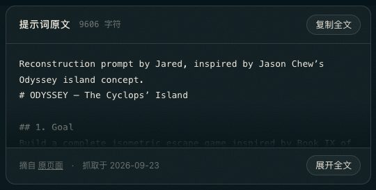

## 第 2 步：在终端里交给 Claude Code

**做什么**：打开终端（Mac：`Command + 空格` 搜「终端」；Windows：搜 `PowerShell`），`cd` 进项目文件夹，输入 `claude` 回车，粘贴提示词，回车。

**会看到什么**：约 17 分钟后得到一个 Vite 项目，源码约 1900 行，拆成 7 个 ES 模块：`world.js`（岛、海、树、山洞、船）、`nav.js`（寻路）、`encounter.js`（任务和巨人的 7 种状态）、`actors.js`（人物动作）、`effects.js`（预警圈、尘土、火花）、`audio.js`（合成音效）、`main.js`（渲染、界面）。three.js 放在本地 `vendor/` 文件夹里，不走网上的 CDN，断网也能跑。

**ES 模块**：一个 `.js` 文件用 `import` / `export` 引用别的文件。浏览器出于安全规定，不允许从本地文件（`file://`）加载模块，所以下一步必须开本地服务。

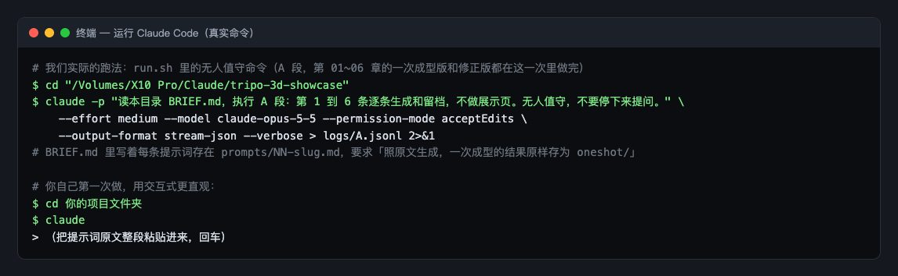

## 第 3 步：用本地服务打开一次成型版

**做什么**：

```
cd results/06-cyclops-island/oneshot
python3 -m http.server 8000 --bind 127.0.0.1
```

浏览器打开 `http://127.0.0.1:8000/`，点地面让奥德修斯走，按 `E` 拿补给，按空格闪避。

**为什么**：`python3 -m http.server` 用 Python 自带的小工具把当前文件夹变成一个本机网站，`8000` 是端口号，`--bind 127.0.0.1` 表示只让本机访问。用完按 `Ctrl + C` 停掉。

**会看到什么**：游戏能跑，整体布局和参考截图一致（四角面板、沙路、橄榄林、沉睡的巨人、红帆船），但玩一会儿就能发现问题：

1. 三名船员跟着走，腿却一动不动。
2. 站在第 1 堆补给旁按 `E`，拿走的是第 2 堆；第 3 堆怎么都拿不到，进不了逃跑段。
3. 被巨人正中砸到，人原地不动，没有被击退。
4. 海面满是白色斜条纹，像在下雨。
5. 巨人砸地扬起的尘土糊成一大块米色圆盘，盖住三分之一个岛。
6. 右下角性能行写着「1 draw calls · 1 triangles」，明显不对。
7. 手机竖屏上，镜头按钮条压在任务卡下沿。

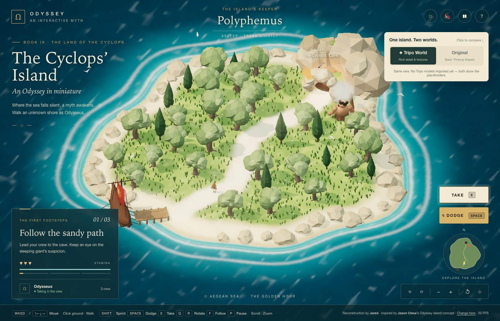

## 第 4 步：按 F12 看控制台，再跑自动验收

**做什么**：按 `F12`（Mac 按 `Command + Option + J`），切到 **Console** 标签，刷新。

**会看到什么**：0 条报错、0 条警告。可问题 1、2 是玩法错了，控制台看不出来。我们另外写了一个自动验收脚本 `acceptance-test.js`：用无头 Chrome（没有窗口、由脚本遥控的 Chrome）按提示词的 14 条要求一条条操作并读游戏状态。14 项里 12 项通过，2 项不通过：

- `K_crew`：三名船员的步伐相位 `phase` 全是 `null`。
- `J_escape`：`escapedMs` 是 -1，没逃出去；`C_collect` 里 `nearIndex` 是 1，说明站在第 0 堆旁边选中的是第 1 堆。

**这说明**：「没报错」不等于「做对了」。玩法类的要求要靠实际操作或脚本去验。

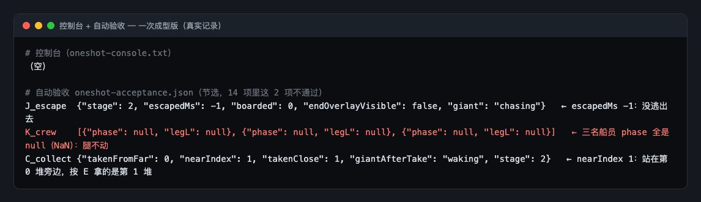

## 第 5 步：修，一共 7 类问题

复制一份成 `fixed/`，只改 `fixed/`，`oneshot/` 原样保留。

### 改动 1：除以 0 让船员腿不动（`encounter.js`）

```
c.speedNow = moved / dt;                  // 改前
c.speedNow = dt > 0 ? moved / dt : 0;     // 改后（主角那一行同样改）
```

速度 = 移动距离 ÷ 这一帧经过的时间 `dt`。偶尔某一帧 `dt` 是 0，`0 / 0` 在 JavaScript 里得到 `NaN`（「不是一个数」）。`NaN` 参与任何计算结果都还是 `NaN`，于是步伐相位永远是 `NaN`，腿就再也不动了。`条件 ? 甲 : 乙` 是「条件成立取甲，否则取乙」。

### 改动 2：按 E 要拿最近的一堆，不是编号最大的一堆

```
// 改前：范围内每找到一堆就覆盖一次，最后留下的是编号最大的
supplies.forEach((s, i) => { if (!s.taken && dist2(hero, s.x, s.z) < T.takeRange) G.nearSupply = i; ... });

// 改后：同时记下距离，只有更近的才替换
G.nearSupply = -1; let nearD = T.takeRange;
supplies.forEach((s, i) => { const sd = dist2(hero, s.x, s.z); if (!s.taken && sd < nearD) { G.nearSupply = i; nearD = sd; } ... });
```

### 改动 3：正中砸到时也要被击退

```
// 改后：人正好站在落点上时，「落点→人」的方向是 (0,0)，改成沿「巨人→人」的方向推开
let dx = hero.pos.x - fromX, dz = hero.pos.z - fromZ;
if (Math.hypot(dx, dz) < .05) { dx = hero.pos.x - giant.pos.x; dz = hero.pos.z - giant.pos.z; }
```

### 改动 4：海面斜条纹（`world.js` 里的着色器）

```
float h(vec2 p){ return fract(sin(dot(p, vec2(127.1,311.7))) * 43758.5453); }                          // 改前
float h(vec2 p){ vec3 q = fract(p.xyx * .1031); q += dot(q, q.yzx + 33.33); return fract((q.x + q.y) * q.z); }   // 改后
```

**着色器**（shader）是跑在显卡上、决定每个像素颜色的小程序。`h()` 是一个「伪随机」函数，用来给海面做涟漪。改前那种写法靠 `sin` 放大小数位来制造随机，坐标一大，显卡的计算精度不够，随机就变成了有规律的斜条纹。改后换成不用 `sin` 的写法。反光也改细、改淡（强度 0.25 → 0.12）。

### 改动 5：尘土不再糊成一块

```
size: .35 + Math.random() * .35, grow: .5, color, alpha: .55   // 改前
size: .3 + Math.random() * .3, grow: .35, color, alpha: .2     // 改后
```

`alpha` 是不透明度。每颗尘土半透明，可几十颗叠在一起就成了不透明的一大块。降到 0.2，叠起来也还能透出地面。

### 改动 6：性能行只数到最后一个通道（`main.js`）

```
renderer.info.autoReset = false;               // 改后：不让它每画一次就自动清零
renderer.info.reset(); composer.render();      // 改后：每帧开始时手动清零一次，数完所有后期通道
```

画面要经过好几道「后期」通道（辉光、暗角、颗粒），每道都算一次绘制。默认每道都会把计数清零，所以只剩最后那一道全屏通道的「1 次、1 个三角形」。

### 其他

- 曝光 1.05 → 0.9、半球光 1.05 → 0.8，岛面不再发白，更接近参考图的饱和度。
- `style.css`：手机上镜头按钮条挪到右上角，不再压任务卡。

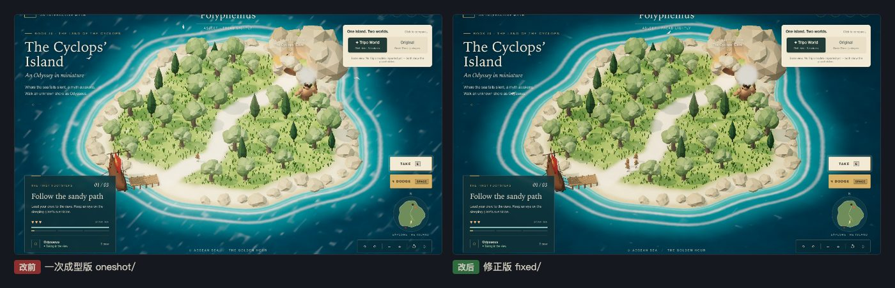

## 第 6 步：v3，把占位模型换成图生 3D 的真模型

修正版里的人物、巨人、树、洞、船都是用几何体拼的「占位模型」。提示词第二阶段要求换成 Tripo 生成的模型。

先认几个词：

- **GLB**：3D 模型的一种文件格式，把形状、贴图、材质打包成一个文件，网页里最常用。
- **PBR**（基于物理的渲染）：材质不只是「一种颜色」，还带粗糙度、金属度等参数，在不同光照下都像真的。
- **面数**：模型表面由很多小三角形拼成，三角形越多越精细，也越费显卡。
- **sRGB**：一种颜色标准。贴图是按 sRGB 存的，渲染器也要按 sRGB 输出，颜色才不会发灰或过艳。

### 6.1 先生成参考图

图生 3D 要先有一张图。每个模型写一段提示词，放在 `assets/v3/prompts/`。以主角为例，全文：

```
Full-body character concept of a bearded ancient Greek adventurer, Odysseus. Bronze Corinthian helmet with a crimson horsehair crest, weathered bronze chest armour over an ivory linen tunic, terracotta-red cape hanging behind, leather sandals, small round bronze shield strapped to the left forearm, short sword sheathed at the right hip. Standing in a clean A-pose, arms angled 45 degrees down, feet shoulder-width apart, facing the viewer at a slight three-quarter angle. Single character, entire body visible from helmet crest to sandals, plain light-grey studio background, soft even lighting, no shadows on the background, realistic proportions, detailed hand-painted PBR textures, no text, no watermark, no base.
```

**为什么这样写**：`A-pose`（双臂斜向下 45°站立）是做角色模型的标准姿势，手臂不贴身体，生成 3D 时不会粘在一起；`single character`、`plain light-grey studio background`（单个主体、干净浅灰背景）让图生 3D 只抠出这一个东西；`no base` 是不要底座。

然后调用生图模型：

```
python3 tools/ds.py img odysseus assets/v3/prompts/odysseus.txt "1024*1024"
```

`tools/ds.py` 是我们写的小脚本，调用阿里百炼的 qwen-image 生图模型，每张记 ¥0.5。它从 macOS 钥匙串取 API 钥匙，不打印钥匙；每调用一次，自动在 `costs/ledger.md` 记一笔账。

独眼巨人试了三次：第 1 张（qwen-image）画成了两只眼；第 2 张把提示词改成大写强调「额头正中只有一只大眼，左右正常位置没有眼睛」（`polyphemus-2.txt`），qwen-image 还是画成两只眼；第 3 张用同一段提示词换 wan2.7 模型，才画对：

```
python3 tools/ds.py img polyphemus-3 assets/v3/prompts/polyphemus-2.txt "1024*1024" wan2.7-image-pro
```

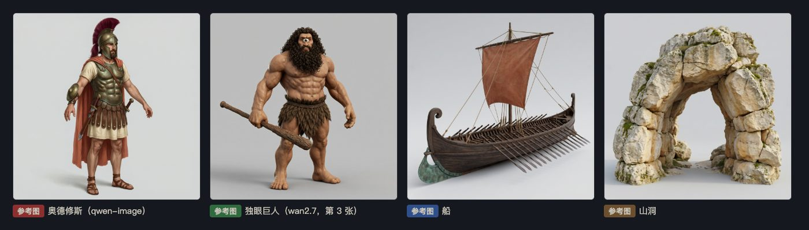

### 6.2 图生 3D

```
python3 tools/ds.py sub odysseus odysseus     # 提交任务：把 refs/odysseus.png 交给 Tripo H3.1
python3 tools/ds.py poll odysseus             # 隔一会儿查一次，成功就把 GLB 下载到 assets/v3/raw/odysseus/
```

生 3D 要几分钟，所以分两步：先「提交」拿到任务号，再「查询」直到完成。我们用的是阿里百炼上的 Tripo H3.1（带贴图和 PBR 材质，每次记 ¥4.2），主角、船、橄榄树、柏树四个成功。提交山洞时被限流，随后账号报欠费，独眼巨人和山洞改走火山方舟的 Seed3D 2.0（`tools/ark.py`，查不到公开单价，按 ¥6 预记）。

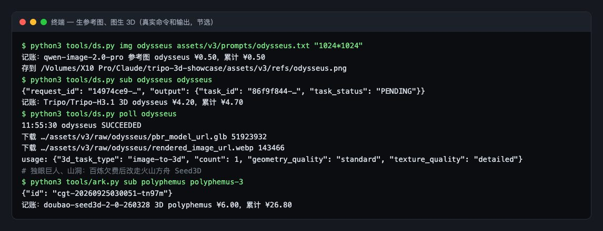

### 6.3 减面、压贴图（gltf-transform）

生成的原始模型每个约 140 万面、50 MB，网页里放不下 6 个。Tripo 的四个用 gltf-transform（一个处理 GLB 的命令行工具）一步完成减面和压贴图，`tools/process-models.py` 里实际执行的是：

```
npx --yes @gltf-transform/cli optimize 原始.glb 输出.glb \
  --compress false --simplify-ratio 0.02055 --simplify-error 0.05 \
  --texture-compress webp --texture-size 2048
```

- `--simplify-ratio`：保留多少比例的面。主角 146 万面 × 0.02055 ≈ 3 万面。
- `--texture-compress webp --texture-size 2048`：贴图转成体积更小的 WebP 格式，边长不超过 2048 像素。
- `--compress false`：不做几何压缩（Draco / meshopt），这样游戏里的加载器不需要额外的解码器。

结果：主角 51.9 MB → 1.4 MB。橄榄树要种 25 棵、柏树 9 棵，分别减到 5 千面和 3 千面、贴图 1K。

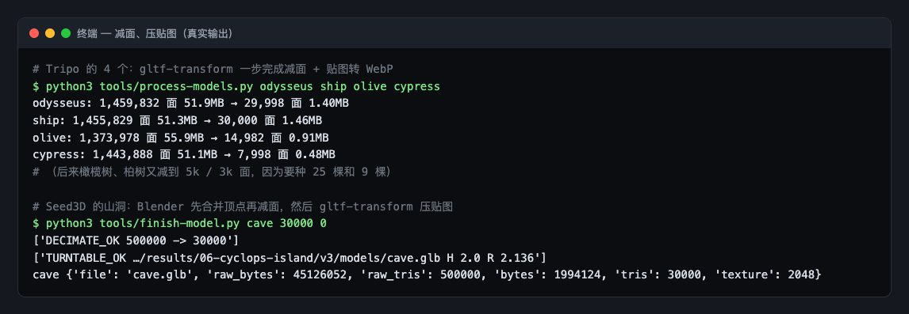

### 6.4 Blender：减面和修独眼

Seed3D 的两个模型贴图接缝多，gltf-transform 减不动，改用 Blender（免费的 3D 软件，可以不开窗口、用 Python 脚本跑）。`tools/decimate.py` 的核心几步：

```python
bpy.ops.import_scene.gltf(filepath=src)                      # 1. 导入 GLB
bpy.ops.mesh.remove_doubles(threshold=1e-5)                  # 2. 合并贴图接缝处重合的顶点
m = o.modifiers.new("dec", "DECIMATE")                       # 3. 加「减面」修改器
m.decimate_type = "COLLAPSE"; m.ratio = ratio
bpy.ops.object.modifier_apply(modifier=m.name)               #    并应用
bpy.ops.export_scene.gltf(filepath=dst, export_format="GLB") # 4. 导出 GLB
```

运行方式：`blender -b -P tools/decimate.py -- 输入.glb 输出.glb 30000`。`-b` 是不开窗口，`-P` 是执行这个脚本。第 2 步很关键：接缝处的顶点位置相同但属于不同的贴图块，不先合并，减面会把贴图边缘撕开，第一次试时巨人的脸就被撕裂了。

独眼巨人还有个问题：参考图是单眼，Seed3D 生成时又做回了双眼。`tools/cyclops-eye.py` 在 Blender 里做了三件事：

1. 从正面相机向两只眼睛的位置各发一条射线，找到它们在贴图上的坐标，用额头的皮肤色盖掉。
2. 在额头加一只眼球（眼白、虹膜、瞳孔三层球）。
3. 先合并顶点，再减面到 6.4 万面。

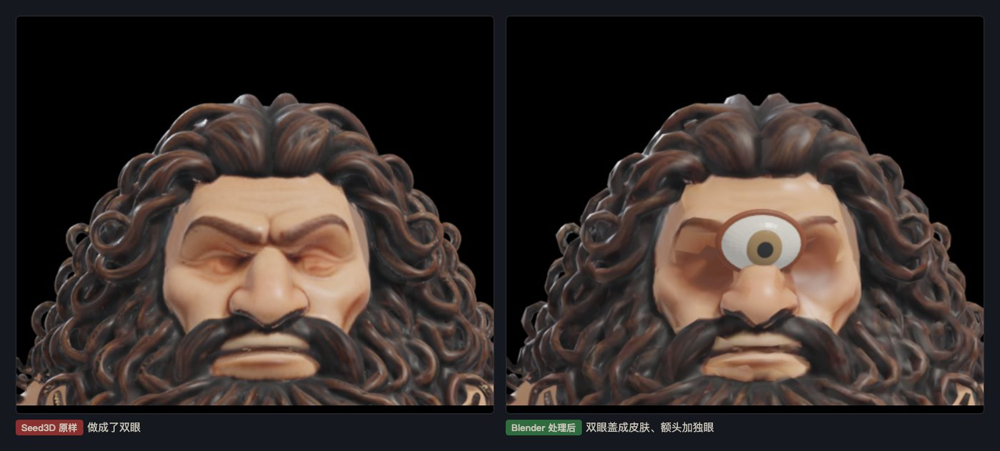

处理完用 `tools/turntable.py` 在 Blender 里渲一圈转台，确认每个模型正反面都没问题：

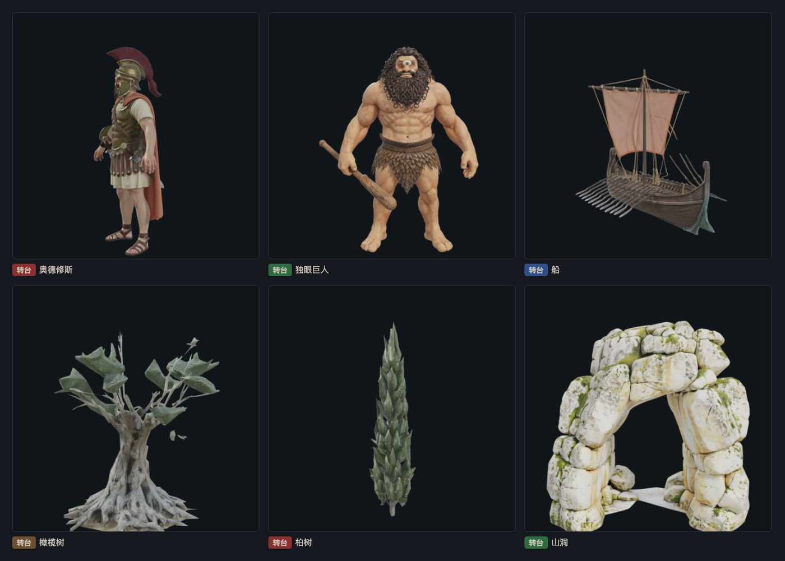

### 6.5 接进 Three.js：一次换一个

模型放进 `v3/models/`，在 `models/manifest.json` 里登记：

```json
{
  "odysseus": { "file": "odysseus.glb", "yaw": -1.5708 },
  "polyphemus": "polyphemus.glb",
  "ship": "ship.glb",
  ...
}
```

游戏启动时读这个清单，用 three.js 的 `GLTFLoader` 加载每个 GLB，替换掉对应的占位模型。不同生成器的模型「正面」朝向不一样，奥德修斯要转 -90°（-1.5708 弧度），所以给 `main.js` 加了 3 行，支持 `yaw`：

```
async function applySlot(key, buffer, source) {             // 改前
async function applySlot(key, buffer, source, yaw = 0) {    // 改后
  ...
    gltf.scene.rotation.y += yaw;   // 改后新增：按清单里的角度转到正面朝 +Z
```

渲染器原本就按提示词设好了，真模型的贴图颜色能正确显示：

```
renderer.outputColorSpace = THREE.SRGBColorSpace;            // 按 sRGB 输出
renderer.toneMapping = THREE.ACESFilmicToneMapping;          // ACES 色调映射
scene.environment = pmrem.fromScene(new RoomEnvironment(), .04).texture;   // PMREM 环境光
```

**色调映射**（tone mapping）：3D 场景里算出来的亮度可以远超屏幕能显示的范围，色调映射负责把它「压」进屏幕能显示的范围，ACES 是电影行业常用的一种压法。**PMREM 环境光**：用一个虚拟房间的光照包住模型，让 PBR 材质的金属、皮肤有反光，不会死黑。

**一次换一个**：每换一个就截图、读槽位状态、看控制台，确认没问题再换下一个。6 步都是 0 报错。换完树以后全场到了 149 万个三角形，于是把橄榄树和柏树再减一次面，降到 90 万。

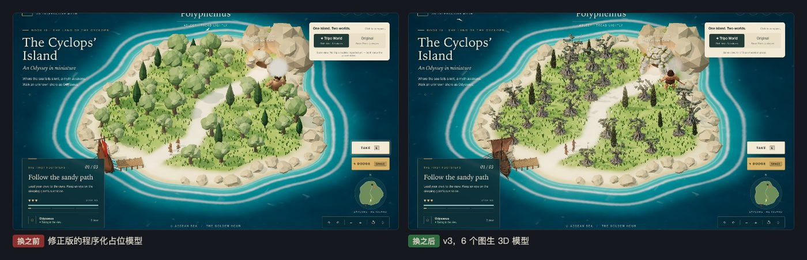

### 6.6 打包：`npm run build`

提示词第 7 节要交静态产物。在 `v3/` 里：

```
npm install
npm run build
```

`npm install` 按 `package.json` 安装 Vite，同时生成 `package-lock.json`（lockfile，锁定每个依赖的准确版本，别人装出来的一模一样）。`npm run build` 把源码打包进 `dist/` 文件夹，这就是可以直接放到网上的静态网站。

第一次失败了：Vite 找不到 `three`。因为 three.js 在 `vendor/` 里，是靠 `index.html` 里的 importmap（告诉浏览器「`three` 这个名字对应哪个文件」的一张表）找到的，Vite 打包时不看 importmap。改法是在 `vite.config.js` 里告诉 Vite 别管它：

```
// 'three' 和 'three/addons/*' 不打包，交给 dist/index.html 里保留的 importmap 在运行时解析
const external = id => id === 'three' || id.startsWith('three/addons/');
export default defineConfig({ base: './', build: { outDir: 'dist', assetsInlineLimit: 0, rollupOptions: { external } }, plugins: [copyStatic()] });
```

`copyStatic()` 是配置里的一个小插件，打包完把 `vendor/` 和 `models/` 复制进 `dist/`。第二次打包成功。

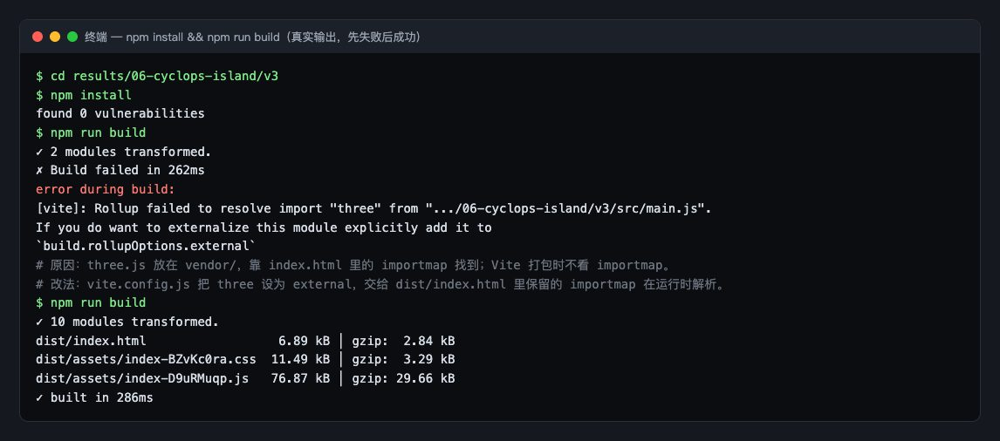

### 6.7 给主角和巨人绑骨骼、配动作（付费，共 10 次）

**为什么要花钱**：图生 3D 出来的模型是一整块「雕塑」，没有骨骼，巨人醒来、追击、砸地只能整体平移、摆动。给现成网格自动蒙皮（把网格的每个顶点绑到一根骨头上）写代码做不了，这是 brief 点名允许花钱的一项。

**做什么**：

1. **先把输入洗干净**。原模型用了 WebP 贴图和压缩扩展，绑骨服务未必认。在 Blender 里重新导出成「单个网格 + JPEG 贴图」的 GLB（主角 3 万面、巨人 6.4 万面）。
2. **放到公网上**。TokenHub 的 `hy-3d-rigging` 只收网址，不收本地文件。把两个 GLB 临时推到展示仓库的 `rig-src/` 目录，用 raw.githubusercontent 的地址（Pages 还没构建完就能用）。下一次整包同步时这个目录会被自动删掉。
3. **一个动作一个任务**。请求体大致是：

```
{ "model": "hy-3d-rigging",
  "file_3d": { "type": "glb", "url": "https://…/rig-src/odysseus-in.glb" },
  "motion_type": 26 }
```

`motion_type` 是预设动作编号。主角做了 6 个：待机、走、跑、闪避、倒地、欢呼；巨人做了 4 个：待机、跑、蓄力攻击、怒吼。每个任务约 20 秒出结果，返回一个带骨骼和动作的 FBX。每次按最高档 ¥7.2 记账，10 次共 ¥72，每条都在 `costs/ledger.md` 写了「为什么非用不可」。

**会遇到的坑**：

- 巨人的文件 4.4 MB，提交时服务端间歇性超时（超时不扣费）。重试两三次就过了。
- 绑骨服务会把模型转 90°。原模型不用转，绑骨后要在清单里多加 -90° 的朝向（yaw，绕竖直轴的转角）。
- Blender 5 换了动作数据结构（slotted actions），老脚本里的 `action.fcurves` 不存在了，合并脚本要删掉这一句。

4. **在 Blender 里合并**。同一个角色的几份 FBX 骨骼完全一样，只是动作不同。脚本 `tools/rig-merge.py` 留下第一份的骨架和网格，其余几份只取动作，按游戏认的名字（`idle`、`walk`、`run`……）命名，最后导出成一个 GLB。FBX 经常把贴图弄丢，脚本会从原始输入 GLB 把材质搬回来。主角：6 段动作、28 根骨头、贴图完整；巨人：4 段动作，6.5 MB（原来 4.1 MB）。

```
blender -b -P tools/rig-merge.py -- assets/v3/rig/polyphemus-rigged.glb assets/v3/rig/polyphemus-in.glb \
  idle=assets/v3/raw/poly-idle/url-0.fbx run=assets/v3/raw/poly-run/url-0.fbx \
  attack=assets/v3/raw/poly-attack/url-0.fbx cheer=assets/v3/raw/poly-cheer/url-0.fbx
```

5. **接进游戏**。游戏里本来就留了「带动画的角色」这条路，会按名字找动作片段。巨人的睡、醒没有对应动作，退回用待机。

**会看到什么**：槽位状态从「Imported · static」变成「Imported · animated」，主角走路时腿在迈步，巨人在洞口前待机时身体在起伏。同一个带骨骼的主角也放上了展示页首页的底座。

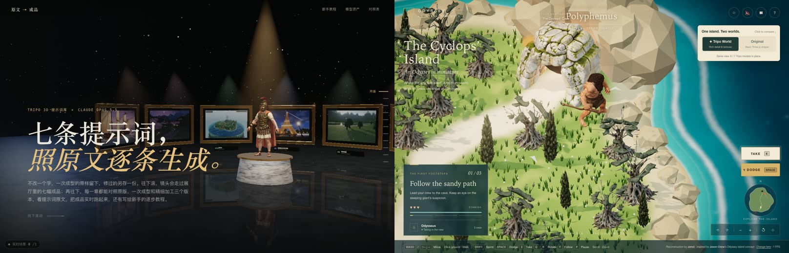

### 6.8 纯代码的画面加工（免费）

新写了 `v3/src/polish.js`，默认开启，加 `?look=flat` 可以关掉对比：

- **移轴景深**：画面上下两边虚化，焦点跟着镜头对准的地方走，整座岛看起来像桌上的微缩模型。
- **云影**：给地面、树、岩石、角色的材质都打一个补丁，让一张缓慢移动的噪声图在上面投下阴影。角色是后面才载入的，所以模型载入完要再打一遍补丁。
- **暖色调色**：高光偏暖，暗部稍微偏青。

**踩过的坑**：第一次截图看不出任何变化，用一小段脚本读页面里的材质，发现一个补丁都没打上。原因是浏览器用的还是缓存里的旧 `main.js`，强制刷新后就好了。还有巨人头顶的一团白雾：那是睡觉时冒的「zzz」，在软件渲染每秒不到 1 帧时会堆在一起，调低了透明度。


## 第 7 步：验证

**做什么**：

1. 修正版：跑自动验收 `acceptance-test.js`，14 项要全部通过；桌面 1400×900、手机 390×844 各截图，和参考截图比对。
2. v3：每换一个模型截一张图、读一次槽位状态；换完后用 `dist/` 版再打开一次，看 6 个模型都载入、控制台 0 报错。

**会看到什么**：修正版 14 项全部通过（锁定落点、蓄力 1.13 秒、闪避无敌、冲击波判定、失败重置、登船计时 11 秒、三名船员各自的步伐等），0 报错 0 警告。v3 的 6 个槽位都显示「Imported · static」（模型没有骨骼动作，如实标成静态），`dist/` 版 0 报错。

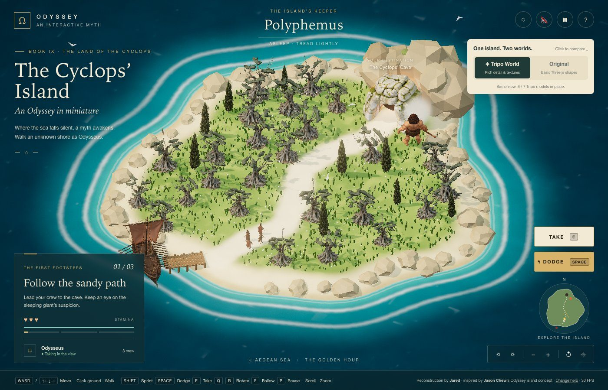

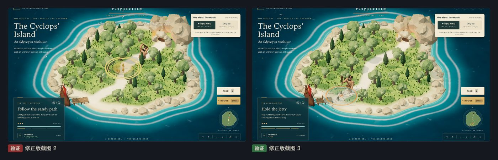

绑骨和画面加工之后（6.7、6.8）：主角和巨人的槽位显示「Imported · animated」，6 段和 4 段动作都能按名字找到，控制台 0 报错。

> 如实记录没测到的：真机手机和触屏手势、真显卡帧数（无头 Chrome 是软件渲染，锁在约 30 fps；后半程显卡进程崩了，退到 SwiftShader，每秒只有 1 帧上下，动作流畅度只看了单帧）、合成音效只确认不报错没有听。还差的：巨人没有「睡」和「醒」的动作，用待机代替；三名船员仍没有骨骼；礁石仍是程序化的；树的数量受面数限制，岛面比原版稀，原版的整体质感仍明显更好。
